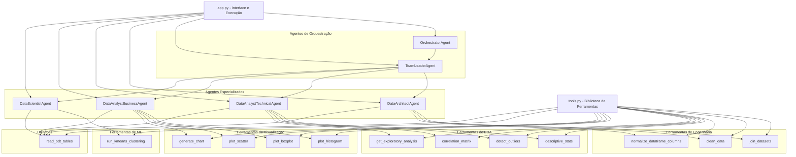
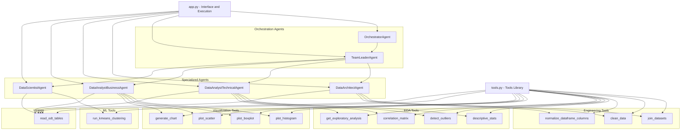

# Consultoria de Dados Autônoma

Uma aplicação web baseada em agentes de IA autônomos para análise exploratória de dados (EDA). Permite que usuários façam upload de arquivos CSV e conversem com uma equipe de agentes especializados para extrair insights, gerar gráficos e obter conclusões acionáveis sobre os dados.

## Demonstração

<video src="agente.mp4" controls></video>

## Sumário

- [Funcionalidades](#funcionalidades)
- [Arquitetura](#arquitetura)
  - [Ferramentas](#ferramentas)
  - [Documentação](#documentação)
  - [Pipeline de Execução](#pipeline-de-execução)
- [Instalação](#instalação)
  - [Pré-requisitos](#pré-requisitos)
  - [Passos](#passos)
- [Uso](#uso)
  - [Exemplos de Perguntas](#exemplos-de-perguntas)
- [Estrutura do Projeto](#estrutura-do-projeto)
- [Dependências](#dependências)
- [Contribuição](#contribuição)
- [Solução de Problemas](#solução-de-problemas)
- [Autor](#autor)
- [Notas](#notas)
- [English (Quick Overview)](#english-quick-overview)

## Funcionalidades

- **Análise Exploratória de Dados (EDA)**: Responde perguntas sobre tipos de dados, distribuições, intervalos, tendências centrais, variabilidade, padrões, valores frequentes, clusters, outliers e correlações.
- **Representações Gráficas + Seleção de Colunas**: Geração automática de histogramas, boxplots, gráficos de dispersão e outras visualizações, com expander para selecionar/confirmar colunas (X/Y) antes da execução.
- **Detecção de Anomalias**: Identificação de outliers usando métodos como IQR e Z-score.
- **Memória de Análises**: Armazena conclusões de análises anteriores para contextualizar respostas futuras.
- **Orquestração Multi-Agente**: Equipe de agentes especializados (Orchestrator, Team Leader, Data Architect, Data Analyst Técnico, Data Analyst de Negócios, Data Scientist) trabalhando em conjunto.
- **Interface Intuitiva**: UI em Streamlit com chat interativo, upload de arquivos e exibição de resultados em tempo real.
- **Upload Multi-Formato**: Suporte a `CSV`, `XLSX`, `XLS` (legacy), `ODS` e `ODT` (tabelas extraídas como DataFrames).
- **Normalização de Colunas**: Opção para normalizar nomes para `snake_case` ASCII (remove acentos e espaços), evitando erros em operações de junção e gráficos.
- **Seleção de DataFrame Padrão**: Escolha qual dataset servirá de base para as análises e preenchimento automático de parâmetros das ferramentas.
- **Relacionamento entre Datasets**: UI para informar se os datasets são correlacionados e definir chaves de junção (iguais ou diferentes) e tipo de junção.
- **Teste de Junção**: Botão "Testar Junção" que pré-visualiza o resultado da união antes da execução do plano.
- **Prévia de Dataset**: Exibição do cabeçalho, amostra (4 linhas), tipos de dados e colunas candidatas a chaves (unicidade > 0.9).
- **Memória Completa**: Armazena a resposta final completa de cada análise na memória da sessão (sem truncamento).
- **Relatório em PDF (ABNT + Pirâmide de Minto)**: Geração e download de relatório com capa, resumo executivo, desenvolvimento, resultados (figuras) e conclusões.
- **Gráficos em Memória + Download**: Renderização de gráficos via bytes (sem depender de arquivos no disco) e botão de download por gráfico.
- **Manutenção**: Botão na sidebar para limpar arquivos antigos `plot_*.png` do diretório.
- **Validação e Auto-correção**: Validação Pydantic do Briefing e do Plano; em caso de erro de schema/JSON, ativa ciclo de auto-correção com feedback ao LLM.
- **Retry Seletivo + Cascata**: Tarefas que falham são replanejadas e reexecutadas uma vez; dependentes já concluídas são invalidadas e reprocessadas quando necessário.
- **Revisão Crítica (QA)**: Após a síntese, um agente revisor (QA) aponta melhorias e limitações; a revisão é usada como contexto na resposta final.
- **Cache de Planos de Sucesso**: Planos sem erros são salvos em cache (por intenção/colunas) e podem ser reutilizados para acelerar execuções futuras.
- **Analytics da Execução**: Expander com métricas por ferramenta (taxa de erro/sucesso, tempo médio) e inputs mais frequentes em erros.
- **Log JSON Opcional**: Toggle para salvar o `execution_log` em `logs/execution_log_<timestamp>.json`.

## Arquitetura

O sistema é baseado em uma arquitetura modular com os seguintes componentes:

### Agentes
- **OrchestratorAgent**: Traduz perguntas do usuário em briefings estruturados.
- **TeamLeaderAgent**: Cria planos de execução passo a passo baseados em briefings.
- **DataArchitectAgent**: Limpa e junta datasets.
- **DataAnalystTechnicalAgent**: Realiza análises estatísticas e EDA profundas.
- **DataAnalystBusinessAgent**: Gera gráficos e insights de negócio.
- **DataScientistAgent**: Aplica machine learning para clusters e previsões.

### Ferramentas
- **Ferramentas de Engenharia**: `join_datasets`, `join_datasets_on`, `clean_data`.
- **Ferramentas de EDA**: `descriptive_stats`, `detect_outliers`, `correlation_matrix`, `get_exploratory_analysis`.
- **Ferramentas de Visualização**: `plot_histogram`, `plot_boxplot`, `plot_scatter`, `generate_chart`.
- **Ferramentas de ML**: `run_kmeans_clustering`.
- **Utilitários de Dados**: `read_odt_tables` (extrai tabelas de ODT) e `normalize_dataframe_columns` (padroniza nomes de colunas).

## Documentação

- Guia de arquitetura e decisões de projeto: [ARCHITECTURE.md](./ARCHITECTURE.md)
- Diagrama de Estrutura (EN): [docs/structure.md](./docs/structure.md)
- Diagrama de Processamento (EN): [docs/data_processing.md](./docs/data_processing.md)
- Diagrama de Relacionamentos (EN): [docs/relationships.md](./docs/relationships.md)
- Guia de Operações/Implantação: [docs/OPERATIONS.md](./docs/OPERATIONS.md)
- Guia de Analytics e Logs: [docs/ANALYTICS.md](./docs/ANALYTICS.md)
- Guia do Cache de Planos: [docs/CACHE.md](./docs/CACHE.md)
- Estratégia de Testes: [docs/TESTING.md](./docs/TESTING.md)
- Troubleshooting: [docs/TROUBLESHOOTING.md](./docs/TROUBLESHOOTING.md)
- Como contribuir: [CONTRIBUTING.md](./CONTRIBUTING.md)
- Código de Conduta: [CODE_OF_CONDUCT.md](./CODE_OF_CONDUCT.md)
- Changelog: [CHANGELOG.md](./CHANGELOG.md)
- Segurança: [docs/SECURITY.md](./docs/SECURITY.md)

### Pipeline de Execução
1. **Briefing**: Orchestrator analisa a pergunta e retorna JSON validado (Pydantic) ou aciona auto-correção.
2. **Plano**: Team Leader cria um plano (validado via Pydantic); em falhas, um ciclo de correção é aplicado.
3. **Execução**: Agentes executam tarefas em ordem/respeito a dependências; em erro, retry seletivo com plano corrigido e reexecução em cascata dos dependentes.
4. **Síntese**: Team Leader sintetiza resultados a partir de um contexto compacto.
5. **Revisão (QA)**: Revisor crítico gera sugestões; revisão é incorporada ao contexto.
6. **Resposta Final**: Data Analyst de Negócios gera resposta final incorporando QA.
7. **Exportação**: Geração do relatório em PDF para download.

### Diagramas

#### Diagrama de Estrutura do Projeto
```mermaid
graph TD
    A[app.py - Interface Web Streamlit] --> B[agents.py - Definições dos Agentes]
    A --> C[tools.py - Ferramentas Especializadas]
    A --> D[prompts.py - Templates de Prompt]
    A --> E[config.py - Configuração de LLM]

    B --> F[OrchestratorAgent - Traduz perguntas em briefings]
    B --> G[TeamLeaderAgent - Cria planos de execução]
    B --> H[DataArchitectAgent - Limpa e junta datasets]
    B --> I[DataAnalystTechnicalAgent - Análises estatísticas]
    B --> J[DataAnalystBusinessAgent - Gera gráficos e insights]
    B --> K[DataScientistAgent - Machine learning]

    C --> L[Ferramentas de Engenharia: join_datasets, clean_data]
    C --> M[Ferramentas de EDA: descriptive_stats, detect_outliers]
    C --> N[Ferramentas de Visualização: plot_histogram, generate_chart]
    C --> O[Ferramentas de ML: run_kmeans_clustering]
    C --> P[Utilitários: read_odt_tables, normalize_dataframe_columns]

    D --> Q[Templates para briefing, plano, síntese e QA]

    E --> R[Integração com LLMs: Groq, OpenAI, Gemini]

    S[config.json - Arquivo de configuração] --> E
    V[plan_cache (session)] --> A
    T[requirements.txt - Dependências] --> U[streamlit, pandas, langchain, etc.]
```

#### Diagrama de Processamento de Dados
```mermaid
flowchart TD
    A[Usuário faz upload de datasets] --> B[Pré-processamento: Normalização de colunas, Seleção de DataFrame padrão]
    B --> C[Configuração de relacionamentos e junções: Chaves, tipo de junção, teste de junção]
    C --> D[Usuário pergunta no chat]
    D --> E[OrchestratorAgent: Briefing estrito em JSON + Validação Pydantic e auto-correção]
    E --> F[TeamLeaderAgent: Plano de execução (JSON) + Validação Pydantic e auto-correção]
    F --> G[Normalização do plano em app.py (variações como tarefas/plano_de_execução/projeto)]
    G --> H[Expander: Seleção/Confirmação de colunas para tarefas de gráficos]
    H --> I[Execução: Agentes chamam ferramentas; retry seletivo e reexecução em cascata se outputs mudarem]
    I --> J[Resultados no shared_context]
    J --> K[TeamLeader sintetiza resultados (contexto compacto)]
    K --> L[Revisão Crítica (QA): sugestões são incorporadas ao contexto]
    L --> M[DataAnalystBusinessAgent: Resposta final com conclusões]
    M --> N[Resposta armazenada na memória da sessão]
    N --> O[Gráficos em memória + download]
    O --> P[PDF: ABNT + Pirâmide de Minto (lazy reportlab)]
    P --> Q[Analytics: taxa por ferramenta, tempo médio, inputs de erro]
    Q --> R[Logs: opcional salvar JSON em logs/]
    R --> S[Fim do processamento]
```

#### Diagrama de Relacionamentos entre Agentes e Ferramentas


### Pré-requisitos
- Python 3.8+
- Conta em provedor de LLM (Groq, OpenAI ou Google Gemini) com chave de API.

### Passos
1. Clone o repositório:
   ```bash
   git clone https://github.com/Benrebello/Autonomous_Data_Consulting
   cd Autonomous_Data_consulting
   ```

2. Instale as dependências:
   ```bash
   pip install -r requirements.txt
   ```

   Observação: o suporte a `.xls` (Excel legado) requer `xlrd`, já incluído no `requirements.txt`. O PDF usa `reportlab` (também incluído).

3. Configure o LLM em `config.json`:
   ```json
   {
     "provider": "groq",
     "model": "llama-3.1-8b-instant",
     "api_key": "sua-chave-aqui"
   }
   ```

4. Execute a aplicação:
   ```bash
   streamlit run app.py
   ```

## Uso

1. Abra a aplicação no navegador.
2. Faça upload de um ou mais arquivos (`CSV`, `XLSX`, `XLS`, `ODS`, `ODT`).
3. Na sidebar:
   - Ative "Normalizar nomes de colunas (snake_case)" (recomendado).
   - Selecione o **DataFrame padrão**.
   - Se houver 2+ datasets, marque se **são relacionados** e defina as **chaves** (iguais ou diferentes) e o **tipo de junção**.
   - Opcionalmente, clique em **Testar Junção** para ver uma prévia.
4. Abra o expansor de **Prévia do DataFrame** para ver cabeçalho, 4 linhas de amostra, tipos e candidatas a chaves.
5. Digite sua pergunta no chat, por exemplo: "Faça uma EDA completa do dataset" ou "Quais são os outliers na coluna 'preço'?".
6. Visualize o plano, o progresso das tarefas, gráficos e a resposta final com conclusões.
7. Faça o download do relatório em PDF (ABNT + Pirâmide de Minto) pelo botão exibido após a resposta.

---

## English (Quick Overview)

This project is a Streamlit-based autonomous multi-agent app for EDA (Exploratory Data Analysis). Upload datasets (CSV, XLSX, XLS, ODS, ODT tables), configure joins, and chat with a team of AI agents to get insights, charts, and a final report.

### Key Features
- Multi-agent orchestration (Orchestrator, Team Leader, Data Architect, Technical/Business Analysts, Data Scientist).
- File uploads: CSV, XLSX, legacy XLS, ODS, and ODT (tables extracted to DataFrames).
- Optional column normalization (snake_case ASCII) to stabilize joins and plots.
- Default DataFrame selection and join configuration UI (same/different keys, join types).
- Dataset preview (headers, 4-row sample, dtypes, key candidates by uniqueness).
- Charts rendered in-memory with per-chart download.
- PDF export (ABNT-like formatting + Minto Pyramid structure).
- Robust JSON and plan normalization to handle model variations.

### Installation
```bash
pip install -r requirements.txt
```
Notes: XLS requires `xlrd`; PDF generation uses `reportlab` (both included in requirements).

### Usage
```bash
streamlit run app.py
```
1) Upload datasets in the sidebar and (optionally) normalize column names.
2) Select the default DataFrame, configure relationships/joins, and test the join.
3) Ask your question in chat (e.g., "Run a complete EDA").
4) Review the execution plan, results, and charts; download the generated PDF report.

### Exemplos de Perguntas
- "Quais são os tipos de dados das colunas?"
- "Gere um histograma para a variável 'idade'."
- "Detecte outliers na coluna 'salário' usando IQR."
- "Qual a correlação entre 'vendas' e 'publicidade'?"
- "Faça uma análise de clusters nos dados."

## Estrutura do Projeto

```
consultoria-dados-autonoma/
├── app.py                 # Aplicação principal Streamlit
├── agents.py              # Definições dos agentes
├── tools.py               # Ferramentas especializadas
├── prompts.py             # Templates de prompt
├── config.py              # Configuração de LLM
├── config.json            # Arquivo de configuração
├── requirements.txt       # Dependências
└── README.md              # Este arquivo
```

## Dependências

- streamlit: Interface web
- pandas: Manipulação de dados
- langchain, langchain-groq, langchain-openai, langchain-google-genai: Integração com LLMs
- matplotlib, seaborn: Visualizações
- scikit-learn: Machine learning (clusters, outliers)
- openpyxl, odfpy, xlrd: Suporte a Excel/ODS/Excel legado
- reportlab: Geração de relatório em PDF
- python-dotenv: Variáveis de ambiente
- pydantic: Modelagem de dados

## Contribuição

1. Fork o projeto.
2. Crie uma branch para sua feature (`git checkout -b feature/nova-ferramenta`).
3. Commit suas mudanças (`git commit -m 'Adiciona nova ferramenta'`).
4. Push para a branch (`git push origin feature/nova-ferramenta`).
5. Abra um Pull Request.

## Solução de Problemas

- **Chave de API ou modelo indisponível**
  - Verifique se a chave foi inserida corretamente na sidebar ou no `config.json`.
  - Caso veja erro de modelo descontinuado (ex.: `model_decommissioned`), troque para `llama-3.1-8b-instant` no `config.json` ou na UI.

- **Erro ao ler arquivos Excel/ODS/ODT**
  - `XLSX`: requer `openpyxl` (já incluso).
  - `XLS` (legado): requer `xlrd` (já incluso). Se faltar, instale: `pip install xlrd`.
  - `ODS`: requer `odfpy` (já incluso). Se faltar, instale: `pip install odfpy`.
  - `ODT`: somente documentos com tabelas são suportados. Cada tabela é convertida em um DataFrame. Se não houver tabelas, um aviso será exibido.

- **Nomes de colunas com acentos/espaços**
  - Ative na sidebar a opção "Normalizar nomes de colunas (snake_case)" para evitar erros em joins e gráficos.

- **Junções com poucos resultados ou colunas duplicadas**
  - Use o painel "Os datasets são relacionados?" para escolher chaves adequadas e o tipo de junção (`inner/left/right/outer`).
  - Use o botão "Testar Junção" para visualizar a união antes de executar o plano e conferir colunas duplicadas (`_x`, `_y`).

- **Plano em JSON fora do schema (sem `execution_plan`)**
  - Os prompts foram endurecidos para JSON estrito e o app normaliza automaticamente variações (ex.: `tarefas`, `plano_de_execucao`, `projeto`). Se ainda falhar, um plano mínimo é gerado para manter o fluxo.

- **Erros de limite de tokens (TPM) em Groq / 413**
  - O contexto enviado para síntese é compactado (amostras pequenas, truncamento de strings). Se necessário, troque para um modelo mais leve (ex.: `llama-3.1-8b-instant`) e reduza datasets muito grandes.

- **Gráficos não aparecem**
  - Verifique se existem colunas numéricas. O sistema seleciona a primeira coluna numérica por padrão para histogramas/boxplots.
  - Gráficos agora são renderizados a partir de bytes em memória; cada gráfico inclui botão de download. Há um botão de manutenção para remover `plot_*.png` antigos.

- **Erros de JSON devolvidos pelo LLM**
  - As respostas são limpas de blocos markdown e validadas. Se o erro persistir, revise o prompt ou tente novamente; a aplicação exibirá mensagens claras do conteúdo inválido.

- **Streaming do texto fragmentado no chat**
  - A aplicação agrega os chunks e apresenta uma única mensagem fluida. Se notar quebras estranhas, recarregue a página para reiniciar o estado.

## Autor

Desenvolvido por [Seu Nome] como parte do desafio individual do curso I2A2.

## Notas

- O sistema usa memória baseada em session state para armazenar conclusões de análises anteriores.
- Para provedores de LLM, certifique-se de que a chave de API tem permissões adequadas.
- Em caso de erros, verifique os logs do Streamlit e os arquivos de configuração.
- ODT: apenas documentos com **tabelas** são suportados (cada tabela é convertida em um DataFrame).

---

## Full README in English

# Autonomous Data Consulting

A web application based on autonomous AI agents for exploratory data analysis (EDA). It allows users to upload CSV files and converse with a team of specialized agents to extract insights, generate graphs, and obtain actionable conclusions about the data.

## Demonstration

<video src="agente.mp4" controls></video>

## Table of Contents

- [Features](#features)
- [Architecture](#architecture)
  - [Tools](#tools)
  - [Documentation](#documentation)
  - [Execution Pipeline](#execution-pipeline)
  - [Diagrams](#diagrams)
- [Installation](#installation)
  - [Prerequisites](#prerequisites)
  - [Steps](#steps)
- [Usage](#usage)
  - [Example Questions](#example-questions)
- [Project Structure](#project-structure)
- [Dependencies](#dependencies)
- [Contribution](#contribution)
- [Troubleshooting](#troubleshooting)
- [Author](#author)
- [Notes](#notes)

## Features

- **Exploratory Data Analysis (EDA)**: Answers questions about data types, distributions, ranges, central tendencies, variability, patterns, frequent values, clusters, outliers, and correlations.
- **Graphical Representations**: Automatic generation of histograms, boxplots, scatter plots, and other visualizations.
- **Anomaly Detection**: Identification of outliers using methods like IQR and Z-score.
- **Analysis Memory**: Stores conclusions from previous analyses to contextualize future responses.
- **Multi-Agent Orchestration**: Team of specialized agents (Orchestrator, Team Leader, Data Architect, Technical Data Analyst, Business Data Analyst, Data Scientist) working together.
- **Intuitive Interface**: Streamlit UI with interactive chat, file uploads, and real-time result display.
- **Multi-Format Upload**: Support for `CSV`, `XLSX`, `XLS` (legacy), `ODS`, and `ODT` (tables extracted as DataFrames).
- **Column Name Normalization**: Option to normalize names to `snake_case` ASCII (removes accents and spaces), avoiding errors in join operations and graphs.
- **Default DataFrame Selection**: Choose which dataset will serve as the base for analyses and automatic parameter filling for tools.
- **Dataset Relationships**: UI to inform if datasets are correlated and define join keys (same or different) and join type.
- **Join Testing**: "Test Join" button that previews the union result before plan execution.
- **Dataset Preview**: Display of header, 4-row sample, data types, and candidate key columns (uniqueness > 0.9).
- **Complete Memory**: Stores the full final answer of each analysis in session memory (without truncation).
- **PDF Report (ABNT + Minto Pyramid)**: Generation and download of report with cover, executive summary, development, results (figures), and conclusions.
- **In-Memory Charts + Download**: Rendering of charts via bytes (without relying on disk files) and per-chart download button.
- **Maintenance**: Button in sidebar to clean old `plot_*.png` files from directory.
- **Plan and JSON Resilience**: Prompts adjusted to force strict JSON output and robust plan normalization for variations outside schema.

## Architecture

The system is based on a modular architecture with the following components:

### Agents
- **OrchestratorAgent**: Translates user questions into structured briefings.
- **TeamLeaderAgent**: Creates step-by-step execution plans based on briefings.
- **DataArchitectAgent**: Cleans and joins datasets.
- **DataAnalystTechnicalAgent**: Performs statistical and deep EDA analyses.
- **DataAnalystBusinessAgent**: Generates graphs and business insights.
- **DataScientistAgent**: Applies machine learning for clusters and predictions.

### Tools
- **Engineering Tools**: `join_datasets`, `join_datasets_on`, `clean_data`.
- **EDA Tools**: `descriptive_stats`, `detect_outliers`, `correlation_matrix`, `get_exploratory_analysis`.
- **Visualization Tools**: `plot_histogram`, `plot_boxplot`, `plot_scatter`, `generate_chart`.
- **ML Tools**: `run_kmeans_clustering`.
- **Data Utilities**: `read_odt_tables` (extracts tables from ODT) and `normalize_dataframe_columns` (standardizes column names).

### Documentation

- Architecture and project decision guide: [ARCHITECTURE.md](./ARCHITECTURE.md)

### Execution Pipeline
1. **Briefing**: Orchestrator analyzes the question.
2. **Plan**: Team Leader creates a plan with dependent tasks.
3. **Execution**: Agents execute tasks in order, resolving dependencies.
4. **Synthesis**: Team Leader synthesizes results.
5. **Final Response**: Business Data Analyst generates response with conclusions and memory.
6. **Export**: PDF report generation for download.

### Diagrams

#### Project Structure Diagram
```mermaid
graph TD
    A[app.py - Streamlit Web Interface] --> B[agents.py - Agent Definitions]
    A --> C[tools.py - Specialized Tools]
    A --> D[prompts.py - Prompt Templates]
    A --> E[config.py - LLM Configuration]

    B --> F[OrchestratorAgent - Translates questions into briefings]
    B --> G[TeamLeaderAgent - Creates execution plans]
    B --> H[DataArchitectAgent - Cleans and joins datasets]
    B --> I[DataAnalystTechnicalAgent - Statistical analyses]
    B --> J[DataAnalystBusinessAgent - Generates graphs and insights]
    B --> K[DataScientistAgent - Machine learning]

    C --> L[Engineering Tools: join_datasets, clean_data]
    C --> M[EDA Tools: descriptive_stats, detect_outliers]
    C --> N[Visualization Tools: plot_histogram, generate_chart]
    C --> O[ML Tools: run_kmeans_clustering]
    C --> P[Utilities: read_odt_tables, normalize_dataframe_columns]

    D --> Q[Templates for briefing, plan, synthesis and QA]

    E --> R[LLM Integration: Groq, OpenAI, Gemini]

    S[config.json - Configuration file] --> E
    V[plan_cache (session)] --> A
    T[requirements.txt - Dependencies] --> U[streamlit, pandas, langchain, etc.]
```

#### Data Processing Diagram
```mermaid
flowchart TD
    A[User uploads datasets] --> B[Preprocessing: Column normalization, Default DataFrame selection]
    B --> C[Relationship and join configuration: Keys, join type, join test]
    C --> D[User asks question in chat]
    D --> E[OrchestratorAgent: Strict JSON briefing + Pydantic validation and auto-correction]
    E --> F[TeamLeaderAgent: Execution plan (JSON) + Pydantic validation and auto-correction]
    F --> G[Plan normalization in app.py (variations like tasks/execution_plan/project)]
    G --> H[Expander: Column selection/confirmation for chart tasks]
    H --> I[Execution: Agents call tools; selective retry and cascading re-execution if outputs change]
    I --> J[Results stored in shared_context]
    J --> K[Team Leader synthesizes results (compact context)]
    K --> L[QA Review: suggestions incorporated into context]
    L --> M[DataAnalystBusinessAgent: Final response with conclusions]
    M --> N[Full response stored in session memory]
    N --> O[In-memory charts + download]
    O --> P[PDF: ABNT-like + Minto Pyramid (lazy reportlab)]
    P --> Q[Analytics: success/error by tool, mean duration, frequent error inputs]
    Q --> R[Logs: optional JSON save to logs/]
    R --> S[End of processing]
```

#### Relationships Diagram between Agents and Tools


