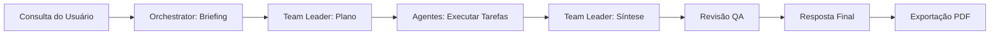
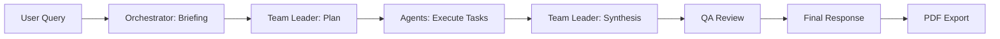

# Autonomous Data Consulting

Sistema multi-agente de IA para análise exploratória de dados (EDA) autônoma. Faça upload de datasets e interaja com uma equipe de agentes especializados para extrair insights, gerar visualizações e obter conclusões acionáveis.

[](https://www.python.org/downloads/)
[](./tests/)
[](./tools/)

[🇧🇷 Versão em Português](#índice) | [🇺🇸 English Version](#english-version)

---

## Índice

- [Sobre](#sobre)
- [Funcionalidades](#funcionalidades)
- [Arquitetura](#arquitetura)
  - [Pacote de Ferramentas Modular](#pacote-de-ferramentas-modular)
  - [Sistema de Agentes](#sistema-de-agentes)
  - [Pipeline de Execução](#pipeline-de-execução)
- [Instalação](#instalação)
- [Uso](#uso)
- [Estrutura do Projeto](#estrutura-do-projeto)
- [Documentação](#documentação)
- [Testes](#testes)
- [Contribuindo](#contribuindo)
- [Licença](#licença)

## Sobre

Sistema multi-agente de IA para análise exploratória de dados (EDA) autônoma. Faça upload de datasets e interaja com uma equipe de agentes especializados para extrair insights, gerar visualizações e obter conclusões acionáveis.

## Funcionalidades

### Capacidades Core
- **🤖 Orquestração Multi-Agente**: 6 agentes especializados trabalhando colaborativamente
- **📊 211 Funções de Análise**: Toolkit abrangente organizado em 21 módulos especializados (125 exportadas)
- **📈 Analytics Avançado**: Testes estatísticos, modelos ML, séries temporais, métricas de negócio
- **💰 Analytics Financeiro**: NPV, TIR, volatilidade, precificação Black-Scholes
- **🔢 Operações Matemáticas**: Cálculo, álgebra linear, otimização
- **📐 Cálculos Geométricos**: Métricas de distância, área de polígonos
- **🎨 Visualizações Ricas**: 7 tipos de gráficos com renderização em memória
- **📄 Suporte Multi-Formato**: CSV, XLSX, XLS, ODS, ODT (extração de tabelas)
- **🔗 Junção Inteligente**: Detecção automática de chaves e configuração de joins
- **📱 UI Interativa**: Chat em tempo real, acompanhamento de progresso, relatórios PDF

### Recursos Avançados
- **🎯 Detecção de Intenção via LLM**: Sistema inteligente com 8 modelos predefinidos de intenção
- **🔧 Tool Registry 100%**: 93 ferramentas registradas com descoberta dinâmica e validação automática
- **🔍 Busca Inteligente**: Normalização de acentos, ordenação por especificidade, validação de compatibilidade
- **💡 Recomendações IA**: Sistema de scoring que sugere ferramentas baseado em características do DataFrame
- **✅ Validação Preventiva**: Verifica requisitos antes de executar (min rows, colunas numéricas, etc.)
- **📊 Sugestões Contextuais**: Análises recomendadas dinamicamente baseadas no dataset
- **🔄 Discovery Conversacional**: Faz perguntas inteligentes apenas quando necessário
- **Gerenciamento de Estado Tipado**: AppState com sincronização bidirecional
- **Rate Limiting**: Controle de RPM com feedback visual
- **Execução Paralela**: Paralelização de tarefas independentes
- **Sistema de Cache Inteligente**: Cache baseado em query + intent + response_mode (TTL 5min direto, 1h completo)
- **Revisão QA**: Análise crítica dos resultados antes da resposta final
- **Métricas & Analytics**: Taxas de sucesso, tempos de execução
- **Exportação PDF**: Relatórios formatados ABNT com estrutura Pirâmide de Minto
- **Integração Nativa de Conectores**: Suporte a queries federadas SQL
- **Modo de Resposta Adaptativo**: Detecção automática de intenção (direto vs completo)
- **Tratamento de Erros Robusto**: Stack traces completos para debugging

## Arquitetura

### Pacote de Ferramentas Modular

O sistema possui um pacote `tools/` totalmente modular com 21 módulos especializados:

```
tools/
├── data_profiling.py          # 17 funções: estatísticas, tipos, cardinalidade
├── statistical_tests.py       # 14 funções: teste t, ANOVA, MANOVA, sobrevivência
├── correlation_analysis.py    # 6 funções: correlação, VIF, relacionamentos
├── outlier_detection.py       # 5 funções: detecção IQR, Z-score
├── visualization.py           # 11 funções: gráficos, plots, heatmaps
├── machine_learning.py        # 42 funções: regressão, classificação, tuning, AutoML
├── clustering.py              # 6 funções: K-means, análise de clusters
├── time_series.py             # 8 funções: decomposição, ARIMA, features
├── feature_engineering.py     # 6 funções: polinomiais, interações, binning
├── business_analytics.py      # 9 funções: RFM, taxa de crescimento, teste A/B, cohort
├── advanced_analytics.py      # 12 funções: previsão, risco, simulação
├── text_analysis.py           # 7 funções: sentimento, tópicos, wordcloud, NER
├── geospatial.py              # 3 funções: mapeamento geográfico
├── data_transformation.py     # 13 funções: joins, pivots, normalização
├── data_cleaning.py           # 7 funções: validação, imputação
├── file_operations.py         # 10 funções: ODT, exportação Excel, conectores
├── math_operations.py         # 8 funções: aritmética, cálculo
├── financial_analytics.py     # 6 funções: NPV, TIR, Black-Scholes
├── advanced_math.py           # 7 funções: sistemas lineares, otimização
├── geometry.py                # 5 funções: distâncias, área de polígonos
└── helpers.py                 # 9 funções: utilitários internos
```

### Sistema de Agentes

**10 Agentes Especializados com IA Adaptativa:**

#### **Agentes Core (6):**
1. **OrchestratorAgent**: Traduz consultas em linguagem natural para briefings estruturados com detecção de intenção
2. **TeamLeaderAgent**: Cria planos de execução e sintetiza resultados
3. **DataArchitectAgent**: Limpeza, junção e preparação de dados
4. **DataAnalystTechnicalAgent**: Análise estatística e EDA profunda
5. **DataAnalystBusinessAgent**: Visualizações e insights de negócio
6. **DataScientistAgent**: Machine learning e modelagem preditiva

#### **Agentes Especializados por Domínio (4):**
7. **FinancialAgent**: Análise financeira especializada (NPV, TIR, volatilidade, Black-Scholes)
8. **MarketingAgent**: Analytics de marketing (RFM, CAC, LTV, segmentação de clientes)
9. **OperationalAgent**: Eficiência operacional (produtividade, gargalos, KPIs operacionais)
10. **DataIntegrationAgent**: Integração de dados federados (conectores SQL, queries distribuídas)

#### **Modo de Resposta Dual:**
- **Modo Direto**: Para perguntas simples → Respostas concisas e focadas
- **Modo Completo**: Para análises profundas → Relatórios abrangentes com PDF

### Pipeline de Execução



## Instalação

### Pré-requisitos
- Python 3.8+
- Chave de API LLM (Groq, OpenAI ou Google Gemini)

### Passos

1. **Clone o repositório:**
   ```bash
   git clone https://github.com/Benrebello/Autonomous_Data_Consulting
   cd Autonomous_Data_Consulting
   ```

2. **Instale as dependências:**
   ```bash
   pip install -r requirements.txt
   ```

3. **Configure o LLM em `config.json`:**
   ```json
   {
     "provider": "groq",
     "model": "llama-3.1-8b-instant",
     "api_key": "sua-chave-api-aqui"
   }
   ```

4. **Execute a aplicação:**
   ```bash
   streamlit run app.py
   ```

## Uso

1. **Faça upload de datasets** (CSV, XLSX, XLS, ODS, ODT) via barra lateral
2. **Configure as definições:**
   - Habilite normalização de colunas (snake_case)
   - Selecione DataFrame padrão
   - Configure relacionamentos entre datasets e chaves de junção
3. **Faça perguntas** em linguagem natural:
   - "Faça uma EDA completa do dataset"
   - "Detecte outliers na coluna 'preço'"
   - "Qual a correlação entre 'vendas' e 'publicidade'?"
   - "Execute clustering K-means com 3 clusters"
4. **Revise os resultados:**
   - Plano de execução com dependências de tarefas
   - Acompanhamento de progresso
   - Visualizações interativas
   - Relatório de análise abrangente
5. **Exporte:** Baixe relatório PDF com descobertas

## Estrutura do Projeto

```
Autonomous_Data_Consulting/
├── app.py                      # Aplicação principal Streamlit
├── agents.py                   # Definições de agentes
├── config.py                   # Configuração LLM
├── state.py                    # Gerenciamento de estado tipado
├── prompts.py                  # Templates de prompts
├── prompt_templates.py         # Geração dinâmica de prompts
├── rate_limiter.py             # Limitação de RPM
├── ui_components.py            # Utilitários de UI
├── optimizations.py            # Otimizações de performance
├── tool_registry.py            # Metadados e registro de ferramentas
├── tools/                      # Pacote de ferramentas modular (21 módulos)
│   ├── __init__.py            # 125 exportações de funções
│   ├── data_profiling.py
│   ├── statistical_tests.py
│   ├── machine_learning.py
│   ├── advanced_analytics.py
│   ├── financial_analytics.py
│   ├── math_operations.py
│   ├── geometry.py
│   └── ... (14 módulos adicionais)
├── tests/                      # Suite de testes (23 testes)
│   ├── test_clustering.py
│   ├── test_business_analytics.py
│   ├── test_tools_mapping.py
│   └── ... (10 arquivos de teste adicionais)
├── docs/                       # Documentação abrangente
│   ├── ARCHITECTURE.md
│   ├── OPERATIONS.md
│   ├── TESTING.md
│   └── ... (11 documentos adicionais)
├── config.json                 # Configuração LLM
├── requirements.txt            # Dependências Python
└── README.md                   # Este arquivo
```

## Documentação

### Documentação Core
- **[ARCHITECTURE.md](./docs/ARCHITECTURE.md)**: Arquitetura do sistema e decisões de design
- **[OPERATIONS.md](./docs/OPERATIONS.md)**: Guia de deployment e operações
- **[TESTING.md](./docs/TESTING.md)**: Estratégia de testes e cobertura
- **[TROUBLESHOOTING.md](./docs/TROUBLESHOOTING.md)**: Problemas comuns e soluções

### Documentação Técnica
- **[RATE_LIMITING.md](./docs/RATE_LIMITING.md)**: Implementação de rate limiting
- **[CACHE.md](./docs/CACHE.md)**: Estratégia de cache de planos
- **[ANALYTICS.md](./docs/ANALYTICS.md)**: Métricas e analytics
- **[SECURITY.md](./docs/SECURITY.md)**: Considerações de segurança
- **[TOOLS_ANALYSIS.md](./docs/TOOLS_ANALYSIS.md)**: Referência completa de ferramentas

### Contribuindo
- **[CONTRIBUTING.md](./CONTRIBUTING.md)**: Diretrizes de contribuição
- **[CODE_OF_CONDUCT.md](./CODE_OF_CONDUCT.md)**: Padrões da comunidade
- **[CHANGELOG.md](./CHANGELOG.md)**: Histórico de versões

## Testes

O projeto inclui uma suite de testes abrangente com 100% de taxa de aprovação:

```bash
pytest -q
# 23 passed, 17 warnings in 14.38s
```

**Cobertura de Testes:**
- ✅ Algoritmos de clustering
- ✅ Engenharia de features
- ✅ Analytics de negócio
- ✅ Análise de séries temporais
- ✅ Análise de texto
- ✅ Transformação de dados
- ✅ Operações de arquivo
- ✅ Validação completa de mapeamento de ferramentas

## Estrutura de Ferramentas

**21 módulos especializados com 211 funções:**

| Módulo | Funções | Descrição |
|--------|---------|-----------|
| data_profiling | 17 | Estatísticas, tipos, cardinalidade |
| statistical_tests | 14 | Testes t, ANOVA, MANOVA, sobrevivência |
| machine_learning | 42 | Regressão, classificação, tuning, AutoML |
| advanced_analytics | 12 | Previsão, risco, simulação Monte Carlo |
| financial_analytics | 6 | NPV, TIR, Black-Scholes |
| math_operations | 8 | Aritmética, derivadas, integrais |
| advanced_math | 7 | Sistemas lineares, otimização |
| geometry | 5 | Distâncias, área de polígonos |
| feature_engineering | 6 | Polinomiais, interações, binning |
| business_analytics | 9 | RFM, taxa de crescimento, teste A/B, cohort |
| time_series | 8 | Decomposição, ARIMA |
| text_analysis | 7 | Sentimento, tópicos, wordcloud, NER |
| visualization | 11 | Histogramas, scatter, heatmaps |
| clustering | 6 | K-means, análise de clusters |
| correlation_analysis | 6 | Correlação, VIF, relações |
| outlier_detection | 5 | IQR, Z-score |
| data_transformation | 13 | Joins, pivots, normalização |
| data_cleaning | 7 | Validação, imputação |
| file_operations | 10 | ODT, exportação Excel, conectores |
| geospatial | 3 | Mapas geográficos |
| helpers | 9 | Utilitários internos |

## Exemplos de Uso

```python
# Exemplos de perguntas (em português para a UI)

# Perguntas Diretas (modo rápido)
"Quais são as medidas de tendência central (média, mediana)?"
"Quanto é o total de vendas?"
"Qual a correlação entre preço e quantidade?"

# Análises Financeiras (FinancialAgent)
"Calcule o NPV com taxa de 10% para os fluxos de caixa"
"Avalie o risco de volatilidade desta carteira"
"Qual a TIR deste investimento?"

# Analytics de Marketing (MarketingAgent)  
"Faça análise RFM dos clientes"
"Qual o CAC por canal de marketing?"
"Avalie a retenção de clientes por segmento"

# Eficiência Operacional (OperationalAgent)
"Quais são os gargalos no processo?"
"Avalie a produtividade por departamento"
"Identifique oportunidades de melhoria operacional"

# Integração de Dados (DataIntegrationAgent)
"Conecte ao banco de dados SQL e execute esta query"
"Junte dados de múltiplas fontes externas"
"Monitore a qualidade dos dados federados"

# Análises Complexas (modo completo)
"Faça uma EDA completa do dataset"
"Execute análise preditiva com machine learning"
"Avalie tendências e padrões temporais"
```

## Tecnologias Principais

- **Frontend**: Streamlit
- **Processamento de Dados**: pandas, numpy
- **ML/Stats**: scikit-learn, scipy, statsmodels
- **Visualização**: matplotlib, seaborn
- **Integração LLM**: langchain (Groq, OpenAI, Gemini)
- **Formatos de Arquivo**: openpyxl, odfpy, xlrd
- **Geração PDF**: reportlab
- **Validação**: pydantic

## Performance

- **Execução Paralela**: Tarefas independentes executam concorrentemente
- **Cache Inteligente**: Sistema dual com TTL adaptativo (5min respostas diretas, 1h análises completas)
- **Compressão de Contexto**: Resultados grandes são automaticamente resumidos
- **Rate Limiting**: Previne throttling de API
- **Lazy Loading**: Ferramentas carregadas sob demanda
- **Detecção de Intenção**: Processamento adaptativo baseado na complexidade da query

## Roadmap

### ✅ Implementado (v1.0)
- [x] Sistema de cache inteligente com TTL duplo
- [x] Agentes especializados por domínio (Financeiro, Marketing, Operacional, Integração)
- [x] Modo de resposta dual (direto vs completo)
- [x] Integração nativa de conectores SQL
- [x] Detecção automática de intenção conversacional
- [x] **Tool Registry 100%**: Descoberta dinâmica, validação, recomendações IA
- [x] **Sistema de Intenção via LLM**: 8 modelos predefinidos com contexto do DataFrame
- [x] **Normalização de texto**: Busca funciona com/sem acentos
- [x] **Validação preventiva**: Feedback claro antes de executar ferramentas
- [x] **Sugestões inteligentes**: Recomendações baseadas em scoring contextual
- [x] **Tratamento de erros**: Stack traces completos para debugging

### 🔄 Em Desenvolvimento (v1.1)
- [ ] Implementar versionamento de dados
- [ ] Criar endpoint REST API
- [ ] Adicionar suporte a dados em streaming em tempo real
- [ ] Implementar recursos colaborativos
- [ ] Adicionar mais modelos ML (CatBoost, Neural Networks)
- [ ] Sistema de feedback do usuário para melhorar recomendações

## Contribuindo

1. Faça fork do repositório
2. Crie uma branch de feature (`git checkout -b feature/nova-ferramenta`)
3. Commit suas mudanças (`git commit -m 'Adiciona nova ferramenta de análise'`)
4. Push para a branch (`git push origin feature/nova-ferramenta`)
5. Abra um Pull Request

Veja [CONTRIBUTING.md](./CONTRIBUTING.md) para diretrizes detalhadas.

## Suporte

Para problemas, questões ou sugestões:
- Abra uma issue no GitHub
- Consulte [TROUBLESHOOTING.md](./docs/TROUBLESHOOTING.md)
- Revise a [documentação](./docs/)

## Licença

Este projeto faz parte do desafio individual I2A2.

## Autor

Desenvolvido por [Ben Rebello](https://github.com/Benrebello)

## Agradecimentos

- Construído com LangChain para orquestração LLM
- Streamlit para UI interativa
- scikit-learn para capacidades ML
- pandas para manipulação de dados

---

# English Version

## Table of Contents

- [Features](#features-1)
- [Architecture](#architecture-1)
  - [Modular Tools Package](#modular-tools-package-1)
  - [Agent System](#agent-system-1)
  - [Execution Pipeline](#execution-pipeline-1)
- [Installation](#installation-1)
- [Usage](#usage-1)
- [Project Structure](#project-structure-1)
- [Documentation](#documentation-1)
- [Testing](#testing-1)
- [Contributing](#contributing-1)
- [License](#license-1)

## About

A multi-agent AI system for autonomous exploratory data analysis (EDA). Upload datasets and interact with a team of specialized AI agents to extract insights, generate visualizations, and obtain actionable conclusions.

## Features

### Core Capabilities
- **🤖 Multi-Agent Orchestration**: 10 specialized AI agents working collaboratively with adaptive intelligence
- **📊 211 Analysis Functions**: Comprehensive toolkit organized in 21 specialized modules (125 exported)
- **📈 Advanced Analytics**: Statistical tests, ML models, time series, business metrics
- **💰 Financial Analytics**: NPV, IRR, volatility, Black-Scholes option pricing
- **🔢 Mathematical Operations**: Calculus, linear algebra, optimization
- **📐 Geometric Calculations**: Distance metrics, polygon area
- **🎨 Rich Visualizations**: 7 chart types with in-memory rendering
- **📄 Multi-Format Support**: CSV, XLSX, XLS, ODS, ODT (table extraction)
- **🔗 Smart Dataset Joining**: Automatic key detection and join configuration
- **📱 Interactive UI**: Real-time chat, progress tracking, PDF reports

### Advanced Features
- **🎯 LLM-Based Intent Detection**: Intelligent system with 8 predefined intent models
- **🔧 100% Tool Registry**: 93 registered tools with dynamic discovery and automatic validation
- **🔍 Smart Search**: Accent normalization, specificity ordering, compatibility validation
- **💡 AI Recommendations**: Scoring system that suggests tools based on DataFrame characteristics
- **✅ Preventive Validation**: Checks requirements before execution (min rows, numeric columns, etc.)
- **📊 Contextual Suggestions**: Dynamically recommended analyses based on dataset
- **🔄 Conversational Discovery**: Asks intelligent questions only when necessary
- **Typed State Management**: AppState with bidirectional sync
- **Rate Limiting**: RPM control with visual feedback
- **Parallel Execution**: Independent task parallelization
- **Smart Cache System**: Query + intent + response_mode based cache (5min direct, 1h complete TTL)
- **QA Review**: Critical analysis of results before final response
- **Metrics & Analytics**: Tool success rates, execution times
- **PDF Export**: ABNT-formatted reports with Minto Pyramid structure
- **Native SQL Connectors**: Federated query support across data sources
- **Adaptive Response Mode**: Automatic intent detection (direct vs complete mode)
- **Robust Error Handling**: Complete stack traces for debugging

## Architecture

### Modular Tools Package

The system features a fully modular `tools/` package with 21 specialized modules:

```
tools/
├── data_profiling.py          # 17 functions: stats, types, cardinality
├── statistical_tests.py       # 14 functions: t-test, ANOVA, MANOVA, survival
├── correlation_analysis.py    # 6 functions: correlation, VIF, relationships
├── outlier_detection.py       # 5 functions: IQR, Z-score detection
├── visualization.py           # 11 functions: charts, plots, heatmaps
├── machine_learning.py        # 42 functions: regression, classification, tuning, AutoML
├── clustering.py              # 6 functions: K-means, cluster analysis
├── time_series.py             # 8 functions: decomposition, ARIMA, features
├── feature_engineering.py     # 6 functions: polynomial, interactions, binning
├── business_analytics.py      # 9 functions: RFM, growth rate, A/B testing, cohort
├── advanced_analytics.py      # 12 functions: forecasting, risk, simulation
├── text_analysis.py           # 7 functions: sentiment, topics, wordcloud, NER
├── geospatial.py              # 3 functions: geographic mapping
├── data_transformation.py     # 13 functions: joins, pivots, normalization
├── data_cleaning.py           # 7 functions: validation, imputation
├── file_operations.py         # 10 functions: ODT, Excel export, connectors
├── math_operations.py         # 8 functions: arithmetic, calculus
├── financial_analytics.py     # 6 functions: NPV, IRR, Black-Scholes
├── advanced_math.py           # 7 functions: linear systems, optimization
├── geometry.py                # 5 functions: distances, polygon area
└── helpers.py                 # 9 functions: internal utilities
```

### Agent System

**10 Specialized Agents with Adaptive AI:**

#### **Core Agents (6):**
1. **OrchestratorAgent**: Translates natural language queries into structured briefings with intent detection
2. **TeamLeaderAgent**: Creates execution plans and synthesizes results
3. **DataArchitectAgent**: Data cleaning, joining, and preparation
4. **DataAnalystTechnicalAgent**: Statistical analysis and deep EDA
5. **DataAnalystBusinessAgent**: Visualizations and business insights
6. **DataScientistAgent**: Machine learning and predictive modeling

#### **Domain-Specific Agents (4):**
7. **FinancialAgent**: Specialized financial analysis (NPV, IRR, volatility, Black-Scholes)
8. **MarketingAgent**: Marketing analytics (RFM, CAC, LTV, customer segmentation)
9. **OperationalAgent**: Operational efficiency (productivity, bottlenecks, operational KPIs)
10. **DataIntegrationAgent**: Federated data integration (SQL connectors, distributed queries)

#### **Dual Response Mode:**
- **Direct Mode**: For simple questions → Concise, focused responses
- **Complete Mode**: For deep analysis → Comprehensive reports with PDF

### Execution Pipeline



## Installation

### Prerequisites
- Python 3.8+
- LLM API key (Groq, OpenAI, or Google Gemini)

### Steps

1. **Clone the repository:**
   ```bash
   git clone https://github.com/Benrebello/Autonomous_Data_Consulting
   cd Autonomous_Data_Consulting

   ```

2. **Install dependencies:**
   ```bash
   pip install -r requirements.txt
   ```

3. **Configure LLM in `config.json`:**
   ```json
   {
     "provider": "groq",
     "model": "llama-3.1-8b-instant",
     "api_key": "your-api-key-here"
   }
   ```

4. **Run the application:**
   ```bash
   streamlit run app.py
   ```

## Usage

1. **Upload datasets** (CSV, XLSX, XLS, ODS, ODT) via sidebar
2. **Configure settings:**
   - Enable column normalization (snake_case)
   - Select default DataFrame
   - Configure dataset relationships and join keys
3. **Ask questions** in natural language:
   - "What are the measures of central tendency (mean, median)?" *(Direct Mode)*
   - "Perform a complete EDA on the dataset" *(Complete Mode)*
   - "Calculate NPV with 10% rate for cash flows" *(Financial Agent)*
   - "Run RFM analysis on customers" *(Marketing Agent)*
   - "Identify operational bottlenecks" *(Operational Agent)*
   - "Connect to SQL database and run this query" *(Data Integration Agent)*
4. **Review results:**
   - Execution plan with task dependencies
   - Progress tracking
   - Interactive visualizations
   - Comprehensive analysis report
5. **Export:** Download PDF report with findings

## Project Structure

```
Autonomous_Data_Consulting/
├── app.py                      # Main Streamlit application
├── agents.py                   # Agent definitions
├── config.py                   # LLM configuration
├── state.py                    # Typed state management
├── prompts.py                  # Prompt templates
├── prompt_templates.py         # Dynamic prompt generation
├── rate_limiter.py             # RPM rate limiting
├── ui_components.py            # UI utilities
├── optimizations.py            # Performance optimizations
├── tool_registry.py            # Tool metadata and registry
├── tools/                      # Modular tools package (21 modules)
│   ├── __init__.py            # 125 function exports
│   ├── data_profiling.py
│   ├── statistical_tests.py
│   ├── machine_learning.py
│   ├── advanced_analytics.py
│   ├── financial_analytics.py
│   ├── math_operations.py
│   ├── geometry.py
│   └── ... (14 more modules)
├── tests/                      # Test suite (23 tests)
│   ├── test_clustering.py
│   ├── test_business_analytics.py
│   ├── test_tools_mapping.py
│   └── ... (10 more test files)
├── docs/                       # Comprehensive documentation
│   ├── ARCHITECTURE.md
│   ├── OPERATIONS.md
│   ├── TESTING.md
│   └── ... (11 more docs)
├── config.json                 # LLM configuration
├── requirements.txt            # Python dependencies
└── README.md                   # This file
```

## Documentation

### Core Documentation
- **[ARCHITECTURE.md](./docs/ARCHITECTURE.md)**: System architecture and design decisions
- **[OPERATIONS.md](./docs/OPERATIONS.md)**: Deployment and operations guide
- **[TESTING.md](./docs/TESTING.md)**: Testing strategy and coverage
- **[TROUBLESHOOTING.md](./docs/TROUBLESHOOTING.md)**: Common issues and solutions

### Technical Documentation
- **[RATE_LIMITING.md](./docs/RATE_LIMITING.md)**: Rate limiting implementation
- **[CACHE.md](./docs/CACHE.md)**: Plan caching strategy
- **[ANALYTICS.md](./docs/ANALYTICS.md)**: Metrics and analytics
- **[SECURITY.md](./docs/SECURITY.md)**: Security considerations
- **[TOOLS_ANALYSIS.md](./docs/TOOLS_ANALYSIS.md)**: Complete tools reference

### Contributing
- **[CONTRIBUTING.md](./CONTRIBUTING.md)**: Contribution guidelines
- **[CODE_OF_CONDUCT.md](./CODE_OF_CONDUCT.md)**: Community standards
- **[CHANGELOG.md](./CHANGELOG.md)**: Version history

## Testing

The project includes a comprehensive test suite with 100% pass rate:

```bash
pytest -q
# 23 passed, 17 warnings in 14.38s
```

**Test Coverage:**
- ✅ Clustering algorithms
- ✅ Feature engineering
- ✅ Business analytics
- ✅ Time series analysis
- ✅ Text analysis
- ✅ Data transformation
- ✅ File operations
- ✅ Complete tool mapping validation

## Key Technologies

- **Frontend**: Streamlit
- **Data Processing**: pandas, numpy
- **ML/Stats**: scikit-learn, scipy, statsmodels
- **Visualization**: matplotlib, seaborn
- **LLM Integration**: langchain (Groq, OpenAI, Gemini)
- **File Formats**: openpyxl, odfpy, xlrd
- **PDF Generation**: reportlab
- **Validation**: pydantic

## Performance

- **Parallel Execution**: Independent tasks run concurrently
- **Smart Cache System**: Dual TTL adaptive caching (5min direct responses, 1h complete analysis)
- **Context Compression**: Large results automatically summarized
- **Rate Limiting**: Prevents API throttling
- **Lazy Loading**: Tools loaded on demand
- **Intent Detection**: Adaptive processing based on query complexity

## Roadmap

### ✅ Implemented (v1.0)
- [x] Smart cache system with dual TTL
- [x] Domain-specific agents (Financial, Marketing, Operational, Integration)
- [x] Dual response mode (direct vs complete)
- [x] Native SQL connector integration
- [x] Automatic conversational intent detection
- [x] **100% Tool Registry**: Dynamic discovery, validation, AI recommendations
- [x] **LLM Intent System**: 8 predefined models with DataFrame context
- [x] **Text normalization**: Search works with/without accents
- [x] **Preventive validation**: Clear feedback before executing tools
- [x] **Smart suggestions**: Context-based scoring recommendations
- [x] **Error handling**: Complete stack traces for debugging

### 🔄 In Development (v1.1)
- [ ] Implement data versioning
- [ ] Create REST API endpoint
- [ ] Add real-time streaming data support
- [ ] Implement collaborative features
- [ ] Add more ML models (CatBoost, Neural Networks)
- [ ] User feedback system to improve recommendations

## Contributing

1. Fork the repository
2. Create a feature branch (`git checkout -b feature/new-tool`)
3. Commit your changes (`git commit -m 'Add new analysis tool'`)
4. Push to the branch (`git push origin feature/new-tool`)
5. Open a Pull Request

See [CONTRIBUTING.md](./CONTRIBUTING.md) for detailed guidelines.

## Support

For issues, questions, or suggestions:
- Open an issue on GitHub
- Check [TROUBLESHOOTING.md](./docs/TROUBLESHOOTING.md)
- Review [documentation](./docs/)

## License

This project is part of the I2A2 individual challenge.

## Author

Developed by [Ben Rebello](https://github.com/Benrebello)

## Acknowledgments

- Built with LangChain for LLM orchestration
- Streamlit for interactive UI
- scikit-learn for ML capabilities
- pandas for data manipulation

---
