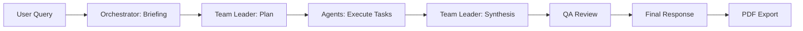
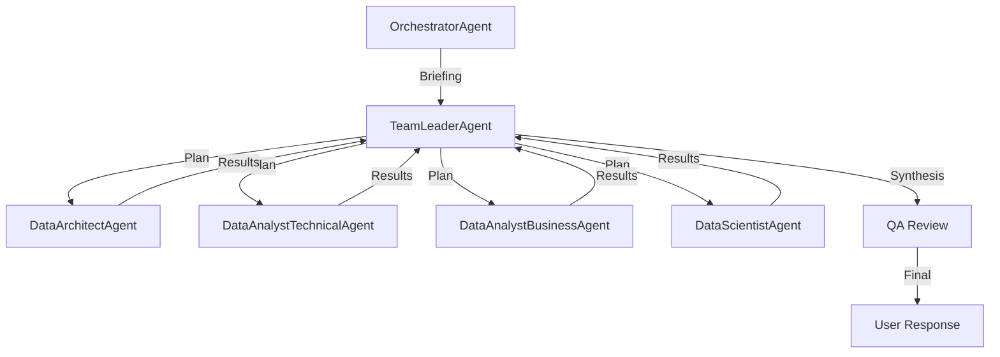

# Autonomous Data Consulting

A multi-agent AI system for autonomous exploratory data analysis (EDA). Upload datasets and interact with a team of specialized AI agents to extract insights, generate visualizations, and obtain actionable conclusions.

[](https://www.python.org/downloads/)
[](./tests/)
[](./tools/)

[🇧🇷 Versão em Português](#versão-em-português) | [🇺🇸 English Version](#table-of-contents)

---

## Table of Contents

- [Features](#features)
- [Architecture](#architecture)
  - [Modular Tools Package](#modular-tools-package)
  - [Agent System](#agent-system)
  - [Execution Pipeline](#execution-pipeline)
- [Installation](#installation)
- [Usage](#usage)
- [Project Structure](#project-structure)
- [Documentation](#documentation)
- [Testing](#testing)
- [Contributing](#contributing)
- [License](#license)

## Features

### Core Capabilities
- **🤖 Multi-Agent Orchestration**: 6 specialized AI agents working collaboratively
- **📊 122 Analysis Tools**: Comprehensive toolkit organized in 21 specialized modules
- **📈 Advanced Analytics**: Statistical tests, ML models, time series, business metrics
- **💰 Financial Analytics**: NPV, IRR, volatility, Black-Scholes option pricing
- **🔢 Mathematical Operations**: Calculus, linear algebra, optimization
- **📐 Geometric Calculations**: Distance metrics, polygon area
- **🎨 Rich Visualizations**: 7 chart types with in-memory rendering
- **📄 Multi-Format Support**: CSV, XLSX, XLS, ODS, ODT (table extraction)
- **🔗 Smart Dataset Joining**: Automatic key detection and join configuration
- **📱 Interactive UI**: Real-time chat, progress tracking, PDF reports

### Advanced Features
- **Dynamic Tool Registry**: 81 tools with automatic parameter defaults
- **Typed State Management**: AppState with bidirectional sync
- **Rate Limiting**: RPM control with visual feedback
- **Parallel Execution**: Independent task parallelization
- **Plan Caching**: Reuse successful execution plans
- **QA Review**: Critical analysis of results before final response
- **Metrics & Analytics**: Tool success rates, execution times
- **PDF Export**: ABNT-formatted reports with Minto Pyramid structure

## Architecture

### Modular Tools Package

The system features a fully modular `tools/` package with 21 specialized modules:

```
tools/
├── data_profiling.py          # 15 functions: stats, types, cardinality
├── statistical_tests.py       # 11 functions: t-test, ANOVA, MANOVA, survival
├── correlation_analysis.py    # 4 functions: correlation, VIF, relationships
├── outlier_detection.py       # 3 functions: IQR, Z-score detection
├── visualization.py           # 7 functions: charts, plots, heatmaps
├── machine_learning.py        # 15 functions: regression, classification, tuning
├── clustering.py              # 3 functions: K-means, cluster analysis
├── time_series.py             # 4 functions: decomposition, ARIMA, features
├── feature_engineering.py     # 5 functions: polynomial, interactions, binning
├── business_analytics.py      # 4 functions: RFM, growth rate, A/B testing
├── advanced_analytics.py      # 7 functions: forecasting, risk, simulation
├── text_analysis.py           # 3 functions: sentiment, topics, wordcloud
├── geospatial.py              # 1 function: geographic mapping
├── data_transformation.py     # 8 functions: joins, pivots, normalization
├── data_cleaning.py           # 6 functions: validation, imputation
├── file_operations.py         # 3 functions: ODT, Excel export
├── math_operations.py         # 7 functions: arithmetic, calculus
├── financial_analytics.py     # 5 functions: NPV, IRR, Black-Scholes
├── advanced_math.py           # 3 functions: linear systems, optimization
├── geometry.py                # 3 functions: distances, polygon area
└── helpers.py                 # 7 functions: internal utilities
```

### Agent System

**6 Specialized Agents:**

1. **OrchestratorAgent**: Translates natural language queries into structured briefings
2. **TeamLeaderAgent**: Creates execution plans and synthesizes results
3. **DataArchitectAgent**: Data cleaning, joining, and preparation
4. **DataAnalystTechnicalAgent**: Statistical analysis and deep EDA
5. **DataAnalystBusinessAgent**: Visualizations and business insights
6. **DataScientistAgent**: Machine learning and predictive modeling

### Execution Pipeline



## Installation

### Prerequisites
- Python 3.8+
- LLM API key (Groq, OpenAI, or Google Gemini)

### Steps

1. **Clone the repository:**
   ```bash
   git clone https://github.com/Benrebello/Autonomous_Data_Consulting
   cd Autonomous_Data_Consulting

   ```

2. **Install dependencies:**
   ```bash
   pip install -r requirements.txt
   ```

3. **Configure LLM in `config.json`:**
   ```json
   {
     "provider": "groq",
     "model": "llama-3.1-8b-instant",
     "api_key": "your-api-key-here"
   }
   ```

4. **Run the application:**
   ```bash
   streamlit run app.py
   ```

## Usage

1. **Upload datasets** (CSV, XLSX, XLS, ODS, ODT) via sidebar
2. **Configure settings:**
   - Enable column normalization (snake_case)
   - Select default DataFrame
   - Configure dataset relationships and join keys
3. **Ask questions** in natural language:
   - "Perform a complete EDA on the dataset"
   - "Detect outliers in the 'price' column"
   - "What's the correlation between 'sales' and 'advertising'?"
   - "Run K-means clustering with 3 clusters"
4. **Review results:**
   - Execution plan with task dependencies
   - Progress tracking
   - Interactive visualizations
   - Comprehensive analysis report
5. **Export:** Download PDF report with findings

## Project Structure

```
Autonomous_Data_Consulting/
├── app.py                      # Main Streamlit application
├── agents.py                   # Agent definitions
├── config.py                   # LLM configuration
├── state.py                    # Typed state management
├── prompts.py                  # Prompt templates
├── prompt_templates.py         # Dynamic prompt generation
├── rate_limiter.py             # RPM rate limiting
├── ui_components.py            # UI utilities
├── optimizations.py            # Performance optimizations
├── tool_registry.py            # Tool metadata and registry
├── tools/                      # Modular tools package (21 modules)
│   ├── __init__.py            # 122 function exports
│   ├── data_profiling.py
│   ├── statistical_tests.py
│   ├── machine_learning.py
│   ├── advanced_analytics.py
│   ├── financial_analytics.py
│   ├── math_operations.py
│   ├── geometry.py
│   └── ... (14 more modules)
├── tests/                      # Test suite (23 tests)
│   ├── test_clustering.py
│   ├── test_business_analytics.py
│   ├── test_tools_mapping.py
│   └── ... (10 more test files)
├── docs/                       # Comprehensive documentation
│   ├── ARCHITECTURE.md
│   ├── OPERATIONS.md
│   ├── TESTING.md
│   └── ... (11 more docs)
├── config.json                 # LLM configuration
├── requirements.txt            # Python dependencies
└── README.md                   # This file
```

## Documentation

### Core Documentation
- **[ARCHITECTURE.md](./docs/ARCHITECTURE.md)**: System architecture and design decisions
- **[OPERATIONS.md](./docs/OPERATIONS.md)**: Deployment and operations guide
- **[TESTING.md](./docs/TESTING.md)**: Testing strategy and coverage
- **[TROUBLESHOOTING.md](./docs/TROUBLESHOOTING.md)**: Common issues and solutions

### Technical Documentation
- **[RATE_LIMITING.md](./docs/RATE_LIMITING.md)**: Rate limiting implementation
- **[CACHE.md](./docs/CACHE.md)**: Plan caching strategy
- **[ANALYTICS.md](./docs/ANALYTICS.md)**: Metrics and analytics
- **[SECURITY.md](./docs/SECURITY.md)**: Security considerations
- **[TOOLS_ANALYSIS.md](./docs/TOOLS_ANALYSIS.md)**: Complete tools reference

### Contributing
- **[CONTRIBUTING.md](./CONTRIBUTING.md)**: Contribution guidelines
- **[CODE_OF_CONDUCT.md](./CODE_OF_CONDUCT.md)**: Community standards
- **[CHANGELOG.md](./CHANGELOG.md)**: Version history

## Testing

The project includes a comprehensive test suite with 100% pass rate:

```bash
pytest -q
# 23 passed, 17 warnings in 14.38s
```

**Test Coverage:**
- ✅ Clustering algorithms
- ✅ Feature engineering
- ✅ Business analytics
- ✅ Time series analysis
- ✅ Text analysis
- ✅ Data transformation
- ✅ File operations
- ✅ Complete tool mapping validation

## Key Technologies

- **Frontend**: Streamlit
- **Data Processing**: pandas, numpy
- **ML/Stats**: scikit-learn, scipy, statsmodels
- **Visualization**: matplotlib, seaborn
- **LLM Integration**: langchain (Groq, OpenAI, Gemini)
- **File Formats**: openpyxl, odfpy, xlrd
- **PDF Generation**: reportlab
- **Validation**: pydantic

## Contributing

1. Fork the repository
2. Create a feature branch (`git checkout -b feature/new-tool`)
3. Commit your changes (`git commit -m 'Add new analysis tool'`)
4. Push to the branch (`git push origin feature/new-tool`)
5. Open a Pull Request

See [CONTRIBUTING.md](./CONTRIBUTING.md) for detailed guidelines.

## License

This project is part of the I2A2 individual challenge.

## Author

Developed by [Ben Rebello](https://github.com/Benrebello)

---

# Versão em Português

## Sobre

Sistema multi-agente de IA para análise exploratória de dados (EDA) autônoma. Faça upload de datasets e interaja com uma equipe de agentes especializados para extrair insights, gerar visualizações e obter conclusões acionáveis.

## Funcionalidades Principais

### Capacidades Core
- **🤖 Orquestração Multi-Agente**: 6 agentes especializados trabalhando colaborativamente
- **📊 122 Ferramentas de Análise**: Toolkit abrangente organizado em 21 módulos especializados
- **📈 Analytics Avançado**: Testes estatísticos, modelos ML, séries temporais, métricas de negócio
- **💰 Analytics Financeiro**: NPV, TIR, volatilidade, precificação Black-Scholes
- **🔢 Operações Matemáticas**: Cálculo, álgebra linear, otimização
- **📐 Cálculos Geométricos**: Métricas de distância, área de polígonos
- **🎨 Visualizações Ricas**: 7 tipos de gráficos com renderização em memória
- **📄 Suporte Multi-Formato**: CSV, XLSX, XLS, ODS, ODT (extração de tabelas)
- **🔗 Junção Inteligente**: Detecção automática de chaves e configuração de joins
- **📱 UI Interativa**: Chat em tempo real, acompanhamento de progresso, relatórios PDF

### Recursos Avançados
- **Registry Dinâmico**: 81 ferramentas com defaults automáticos de parâmetros
- **Gerenciamento de Estado Tipado**: AppState com sincronização bidirecional
- **Rate Limiting**: Controle de RPM com feedback visual
- **Execução Paralela**: Paralelização de tarefas independentes
- **Cache de Planos**: Reutilização de planos de execução bem-sucedidos
- **Revisão QA**: Análise crítica dos resultados antes da resposta final
- **Métricas & Analytics**: Taxas de sucesso, tempos de execução
- **Exportação PDF**: Relatórios formatados ABNT com estrutura Pirâmide de Minto

## Instalação

```bash
# Clone o repositório
git clone https://github.com/Benrebello/Autonomous_Data_Consulting
cd Autonomous_Data_Consulting

# Instale as dependências
pip install -r requirements.txt

# Configure o LLM em config.json
# Execute a aplicação
streamlit run app.py
```

## Estrutura de Ferramentas

**21 módulos especializados com 122 funções:**

| Módulo | Funções | Descrição |
|--------|---------|-----------|
| data_profiling | 15 | Estatísticas, tipos, cardinalidade |
| statistical_tests | 11 | Testes t, ANOVA, MANOVA, sobrevivência |
| machine_learning | 15 | Regressão, classificação, tuning |
| advanced_analytics | 7 | Previsão, risco, simulação Monte Carlo |
| financial_analytics | 5 | NPV, TIR, Black-Scholes |
| math_operations | 7 | Aritmética, derivadas, integrais |
| advanced_math | 3 | Sistemas lineares, otimização |
| geometry | 3 | Distâncias, área de polígonos |
| feature_engineering | 5 | Polinomiais, interações, binning |
| business_analytics | 4 | RFM, taxa de crescimento, A/B test |
| time_series | 4 | Decomposição, ARIMA |
| text_analysis | 3 | Sentimento, tópicos, wordcloud |
| visualization | 7 | Histogramas, scatter, heatmaps |
| clustering | 3 | K-means, análise de clusters |
| correlation_analysis | 4 | Correlação, VIF, relações |
| outlier_detection | 3 | IQR, Z-score |
| data_transformation | 8 | Joins, pivots, normalização |
| data_cleaning | 6 | Validação, imputação |
| file_operations | 3 | ODT, exportação Excel |
| geospatial | 1 | Mapas geográficos |
| helpers | 7 | Utilitários internos |

## Sistema de Agentes



## Pipeline de Execução

1. **Briefing**: Orchestrator analisa a pergunta → JSON estruturado
2. **Planning**: Team Leader cria plano de execução com dependências
3. **Execution**: Agentes executam tarefas em paralelo quando possível
4. **Synthesis**: Team Leader sintetiza resultados
5. **QA Review**: Revisão crítica identifica limitações
6. **Response**: Resposta final incorporando feedback QA
7. **Export**: Geração de relatório PDF

## Exemplos de Uso

```python
# Example questions (in Portuguese for UI)
"Faça uma EDA completa do dataset"
"Detecte outliers na coluna 'preço' usando IQR"
"Qual a correlação entre 'vendas' e 'publicidade'?"
"Execute clustering K-means com 3 clusters"
"Calcule o NPV com taxa de 10% para os fluxos de caixa"
"Ajuste uma distribuição normal aos dados de 'altura'"
```

## Testing

Run the complete test suite:

```bash
# All tests
pytest -q

# Specific module
pytest tests/test_clustering.py -v

# With coverage
pytest --cov=tools --cov-report=html
```

**Test Results:**
- 23/23 tests passing (100%)
- Coverage: Core modules fully tested
- Integration test validates all 81 registered tools

## Documentation

Comprehensive documentation available in `/docs`:

- **ARCHITECTURE.md**: System design and patterns
- **OPERATIONS.md**: Deployment guide
- **TESTING.md**: Test strategy
- **RATE_LIMITING.md**: RPM control implementation
- **CACHE.md**: Plan caching mechanism
- **ANALYTICS.md**: Metrics and logging
- **TOOLS_ANALYSIS.md**: Complete tool reference
- **SECURITY.md**: Security best practices
- **TROUBLESHOOTING.md**: Common issues

## Performance

- **Parallel Execution**: Independent tasks run concurrently
- **Smart Caching**: Successful plans cached by intent
- **Context Compression**: Large results automatically summarized
- **Rate Limiting**: Prevents API throttling
- **Lazy Loading**: Tools loaded on demand

## Roadmap

- [ ] Add more ML models (XGBoost, LightGBM)
- [ ] Implement data versioning
- [ ] Add SQL database connectors
- [ ] Create REST API endpoint
- [ ] Add real-time streaming data support
- [ ] Implement collaborative features

## Contributing

We welcome contributions! Please see [CONTRIBUTING.md](./CONTRIBUTING.md) for:
- Code style guidelines
- Testing requirements
- Pull request process
- Development setup

## Support

For issues, questions, or suggestions:
- Open an issue on GitHub
- Check [TROUBLESHOOTING.md](./docs/TROUBLESHOOTING.md)
- Review [documentation](./docs/)

## Acknowledgments

- Built with LangChain for LLM orchestration
- Streamlit for interactive UI
- scikit-learn for ML capabilities
- pandas for data manipulation

---

**Made with ❤️ for the I2A2 Challenge**
