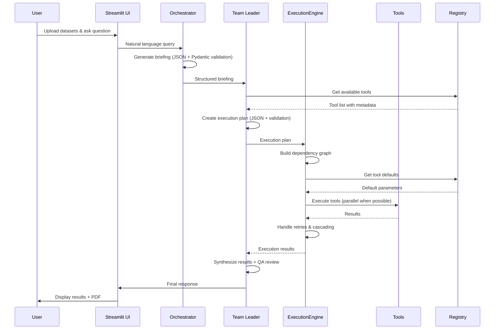

# System Architecture

This document describes the complete architecture of the Autonomous Data Consulting system, including its modular design, execution flow, and optimization strategies.

## Overview

The system follows a modular, multi-agent architecture with clear separation of concerns and comprehensive optimization features:

- **Presentation Layer**: Streamlit UI (`app.py`)
- **Agent Layer**: 6 specialized AI agents (`agents.py`)
- **Tool Layer**: 21 specialized modules with 122 functions (`tools/`)
- **Infrastructure Layer**: State management, rate limiting, execution engine, metrics
- **Configuration Layer**: LLM setup, tool registry (81 registered tools), prompts

## High-Level Overview

- The application is a Streamlit web app (`app.py`) that orchestrates a team of specialized AI agents (`agents.py`) using structured prompts (`prompts.py`) and domain tools (`tools.py`).
- Users upload datasets (CSV, XLSX/XLS, ODS, ODT), configure relationships/joins, and ask for analyses via chat.
  1. Orchestrator converts the user query into a structured "Project Brief" (JSON) and it is validated with Pydantic; auto-correction loop is triggered on schema errors.
  2. Team Leader converts the brief into an "Execution Plan" (JSON), validated with Pydantic; auto-correction loop is triggered on schema errors.
  3. Agents execute the plan by calling functions in `tools.py`, with selective retry on failure and cascading re-execution of dependents when a retried task changes outputs.
  4. Team Leader synthesizes results; then a QA Review step critically evaluates the draft and suggestions are appended to memory context.
  5. Business Analyst returns the final answer; the app stores the full answer in memory and offers PDF export (ABNT-like + Minto Pyramid).

## Architecture Layers

### 1. Presentation Layer
- **File**: `app.py`
- **Responsibility**: Streamlit UI, user interaction, orchestration
- **Key Features**:
  - File upload and dataset management (CSV, XLSX, ODS, ODT)
  - Chat interface with streaming responses
  - Visualization rendering and download
  - PDF report generation (ABNT + Minto Pyramid)
  - Execution log with analytics panel
  - Column-selection UI for chart customization

### 2. Agent Layer
- **File**: `agents.py`
- **Components**: 6 specialized AI agents
  - `OrchestratorAgent`: Converts natural language queries into structured briefings (JSON)
  - `TeamLeaderAgent`: Creates execution plans, synthesizes results, manages retries
  - `DataArchitectAgent`: Data preparation, joining, and schema management
  - `DataAnalystTechnicalAgent`: Statistical analysis and hypothesis testing
  - `DataAnalystBusinessAgent`: Business insights and final narrative generation
  - `DataScientistAgent`: Machine learning and predictive modeling
- **Features**:
  - Pydantic validation with auto-correction loops
  - Rate limiting integration
  - Robust JSON extraction (`clean_json_response()`)

### 3. Tool Layer
- **Package**: `tools/` (21 modules, 122 functions)
- **Registry**: `tool_registry.py` (81 registered tools with metadata)
- **Categories**:
  - **Data Profiling & Quality**: 15 functions (descriptive stats, data types, duplicates)
  - **Statistical Analysis**: 11 functions (t-tests, ANOVA, distribution tests)
  - **Correlation Analysis**: 4 functions (correlation matrix, tests, multicollinearity)
  - **Outlier Detection**: 3 functions (IQR, Z-score methods)
  - **Machine Learning**: 15 functions (regression, classification, evaluation)
  - **Clustering**: 3 functions (K-means, summaries)
  - **Feature Engineering**: 5 functions (polynomial, interaction, binning)
  - **Advanced Analytics**: 7 functions (forecasting, risk assessment, Monte Carlo)
  - **Financial Analytics**: 5 functions (NPV, IRR, Black-Scholes options)
  - **Time Series**: 4 functions (decomposition, ARIMA, features)
  - **Business Analytics**: 4 functions (RFM, growth rate, A/B testing, ABC analysis)
  - **Mathematical Operations**: 7 functions (arithmetic, calculus, derivatives)
  - **Advanced Math**: 3 functions (linear systems, eigenvalues, linear programming)
  - **Geometry**: 3 functions (Euclidean, Haversine distances, polygon area)
  - **Text & NLP**: 3 functions (sentiment, topic modeling, word clouds)
  - **Geospatial**: 1 function (map plotting)
  - **Visualization**: 7 functions (histogram, boxplot, scatter, heatmap, etc.)
  - **Data Transformation**: 8 functions (sort, group, pivot, join)
  - **Data Cleaning**: 6 functions (imputation, normalization, validation)
  - **File Operations**: 3 functions (ODT reading, Excel export)

### 4. Infrastructure Layer

#### State Management (`state.py`)
- **AppState**: Typed dataclass with automatic persistence
- **Features**:
  - Discovery state tracking
  - Conversation history
  - Intent mode management
  - Bidirectional sync with `st.session_state`
  - Automatic migration from legacy keys

#### Execution Engine (`optimizations.py`)
- **ExecutionEngine**: Centralized task execution logic
  - Dependency resolution
  - Automatic retry with error handling
  - Cascading re-execution of dependents
  - Metrics collection
  - Execution logging
- **ParallelExecutor**: Parallel task execution
  - Identifies independent tasks
  - ThreadPoolExecutor-based execution
  - Progress callbacks
- **MetricsCollector**: Performance tracking
  - Task duration monitoring
  - Success/error rate calculation
  - Performance reports
  - Streamlit sidebar integration

#### Rate Limiting (`rate_limiter.py`)
- **RateLimiter**: RPM control per provider
- **RateLimitHandler**: UI feedback for rate limits
- **Features**:
  - Token bucket algorithm
  - Visual feedback in UI
  - Automatic throttling
  - Multi-provider support

#### UI Components (`ui_components.py`)
- Reusable UI elements
- Streaming response handler
- PDF report generation
- Chart cleanup utilities

### 5. Configuration Layer

#### LLM Configuration (`config.py`)
- Multi-provider support (OpenAI, Groq, Anthropic, etc.)
- Environment-based configuration
- Fallback mechanisms

#### Prompt Management (`prompts.py`, `prompt_templates.py`)
- Strict JSON-only prompts
- Dynamic template generation
- QA review prompts
- Schema enforcement

#### Tool Registry (`tool_registry.py`)
- **ToolMetadata**: Complete tool information
  - Function reference
  - Default parameter generation
  - Data requirements validation
  - Category and description
- **Features**:
  - Automatic parameter defaults from DataFrame
  - Validation checks (min rows, column types)
  - Category-based discovery
  - Backward compatibility with legacy code

## Module Organization

### Tools Package Structure

```
tools/
├── __init__.py                 # Central export hub (122 functions)
│
├── Core Analysis
│   ├── data_profiling.py      # 15 functions
│   ├── statistical_tests.py   # 11 functions
│   ├── correlation_analysis.py # 4 functions
│   └── outlier_detection.py   # 3 functions
│
├── Machine Learning
│   ├── machine_learning.py    # 15 functions
│   ├── clustering.py          # 3 functions
│   └── feature_engineering.py # 5 functions
│
├── Advanced Analytics
│   ├── advanced_analytics.py  # 7 functions
│   ├── financial_analytics.py # 5 functions
│   ├── time_series.py         # 4 functions
│   └── business_analytics.py  # 4 functions
│
├── Mathematical Tools
│   ├── math_operations.py     # 7 functions
│   ├── advanced_math.py       # 3 functions
│   └── geometry.py            # 3 functions
│
├── Data Operations
│   ├── data_transformation.py # 8 functions
│   ├── data_cleaning.py       # 6 functions
│   └── file_operations.py     # 3 functions
│
├── Specialized Analysis
│   ├── text_analysis.py       # 3 functions
│   ├── geospatial.py          # 1 function
│   └── visualization.py       # 7 functions
│
└── Internal
    └── helpers.py              # 7 utility functions
```

## Data Flow and Execution Pipeline

### Execution Flow Diagram



### Detailed Pipeline Steps

#### 1. File Upload and Preprocessing
- **Supported formats**: CSV, XLSX, XLS (xlrd), ODS (odf), ODT tables (odfpy)
- **Column normalization**: Optional snake_case ASCII conversion for stability
- **Default DataFrame selection**: Automatic selection for parameter filling
- **Data validation**: Type inference and quality checks

#### 2. Relationship and Join Configuration
- **Sidebar controls**: Dataset selection, join keys, join type (inner/left/right/outer)
- **Preview testing**: Validates join configuration before execution
- **Key detection**: Identifies candidate key columns based on uniqueness
- **Sample display**: Shows headers, dtypes, and sample rows

#### 3. Orchestration (LLM Agents)
- **Orchestrator**:
  - Transforms natural language query into structured briefing (JSON)
  - Pydantic validation with auto-correction loop (up to 3 attempts)
  - Extracts intent, objectives, and deliverables
- **Team Leader**:
  - Creates execution plan from briefing
  - Validates plan structure with Pydantic
  - Handles plan normalization for different LLM outputs
  - Manages fallback plans on repeated failures

#### 4. Task Execution (ExecutionEngine)
- **Dependency Resolution**:
  - Builds dependency graph from tasks
  - Identifies independent tasks for parallel execution
  - Ensures dependencies are satisfied before execution
- **Parameter Management**:
  - Uses `tool_registry.py` for automatic defaults
  - Resolves input references (`@variable_name`)
  - Validates column names against DataFrame
- **Execution Strategy**:
  - Parallel execution of independent tasks (ThreadPoolExecutor)
  - Sequential execution respecting dependencies
  - Progress tracking and metrics collection
- **Error Handling**:
  - Captures full traceback on failures
  - Requests corrected plan from Team Leader
  - Selective retry (max 1 retry per task)
  - Cascading re-execution: Invalidates completed dependents on retry success
- **Context Management**:
  - Stores results in `shared_context`
  - Makes results available to dependent tasks
  - Maintains execution log for analytics

#### 5. Synthesis, QA, and Final Response
- **Context Compression**:
  - DataFrames summarized (shape, columns, dtypes, sample rows)
  - Long strings truncated to avoid token limits
  - Prioritizes key information for synthesis
- **Synthesis Process**:
  - Team Leader aggregates results from all tasks
  - Identifies patterns and key findings
  - Structures information hierarchically
- **QA Review**:
  - Critical evaluation of synthesis draft
  - Suggests improvements and additional insights
  - Appended to memory context for final response
- **Final Response**:
  - Business Analyst generates user-facing narrative
  - Incorporates QA insights
  - Streamed to UI with real-time display
  - Stored untruncated in session memory

#### 6. Visualization and Charts
- **In-Memory Storage**:
  - Charts captured as PNG bytes (BytesIO)
  - No file system dependencies
  - Immediate display in UI
- **Download Options**:
  - Individual chart download buttons
  - Bulk export in PDF reports
- **Chart Types**:
  - Histogram, boxplot, scatter, heatmap
  - Line charts, violin plots
  - Geospatial maps
  - Custom visualizations

#### 7. PDF Export (ABNT + Minto Pyramid)
- **Structure**:
  - Cover page with title and metadata
  - Executive summary (Minto Pyramid: Situation → Complication → Question → Answer)
  - Development section (methods, plan summary, tasks)
  - Results with embedded figures
  - Conclusions and recommendations
  - References note
- **Formatting**:
  - ABNT-like margins and typography
  - Times 12pt font, 1.5 line spacing
  - Professional layout with ReportLab
- **Content**:
  - User query and context
  - Execution plan summary
  - Key findings and insights
  - Embedded visualizations (limited to avoid size issues)

## Error Handling and Robustness

- JSON Parsing Resilience
  - `clean_json_response()` extracts the first balanced JSON object even if the LLM returns text wrappers or markdown.
  - Prompts enforce JSON-only responses to minimize failures.

- Plan Structure Normalization
  - Specific mappers for `tarefas` and `plano_de_execucao` keys.
  - Generic fallback mapping for any list of task-like dicts under other keys (e.g., `projeto`).
  - Minimal default plan if everything else fails, preventing user-facing crashes.

- Token Limits (Groq TPM 413)
  - Shared context compaction (summarize DataFrames, truncate long strings) drastically reduces token usage for synthesis.
  - Optional strategies (not enabled by default) could further reduce payload: ultra-lean summaries, column filtering.

- Media File Storage Errors
  - Optional/lazy imports: PDF generation (ReportLab) loaded on demand; app remains functional without it. Sentiment analysis (TextBlob) is lazy-imported and returns a friendly message if missing.

- Validation and Auto-Correction with Pydantic
  - Briefing and Execution Plan are validated against Pydantic models.
  - Validation errors are summarized and fed back to the LLM with a strict instruction to correct and return JSON-only.

- Selective Retry and Cascading Re-execution
  - On tool errors, traceback is captured and the Team Leader is asked for a corrected plan.
  - The failing task is retried once with suggested corrections; successful retries invalidate already-completed dependents to ensure consistency.

- Analytics and Logging
  - Structured execution log stored in memory with optional JSON persistence.
  - Analytics panel summarizes success/error rates by tool, mean duration, and frequent error inputs.
  - All plots are stored as in-memory bytes; the UI checks existence when encountering legacy paths and warns instead of failing.

## Design Principles

### 1. Modularity
- Each module has a single, well-defined responsibility
- Clear boundaries between modules
- Minimal coupling, high cohesion
- Easy to locate and modify functions

### 2. Discoverability
- Tool registry with comprehensive metadata
- Automatic parameter defaults from DataFrame analysis
- Category-based organization (15 categories)
- Self-documenting code with detailed docstrings

### 3. Extensibility
- Plugin-like architecture for tools
- Dynamic tool loading and registration
- Easy to add new tools without modifying core code
- Backward compatibility maintained

### 4. Testability
- Each module independently testable
- 23 test files with 100% pass rate
- Integration tests for tool mapping
- Defensive testing for optional dependencies

### 5. Performance
- Parallel execution of independent tasks via ExecutionEngine
- Plan caching for repeated queries
- Context compression for large results
- Lazy loading of heavy dependencies (TextBlob, spaCy, etc.)

## Rationale Behind Key Decisions

### Streamlit UI for Rapid Iteration
- Quick development cycle
- Reactive sidebar controls
- Smooth chat display with streaming
- Built-in state management

### Strict JSON Prompts
- Greatly reduce runtime parsing issues
- Minimize branchy error handling
- Enable Pydantic validation
- Consistent structure across LLM providers

### ExecutionEngine Abstraction
- Centralizes complex execution logic
- Removes ~150 lines of manual loop code from app.py
- Makes execution logic testable and reusable
- Provides consistent error handling and retry mechanisms
- Enables metrics collection and performance tracking

### Tool Registry System
- Single source of truth for tool metadata
- Automatic parameter generation eliminates manual defaults
- Validation ensures tools can execute on given data
- Simplifies tool discovery and documentation

### Plan Normalization and Fallbacks
- Accepts real-world variance in LLM outputs
- Works across different providers and models
- Keeps execution stable despite JSON variations
- Minimal fallback plans prevent crashes

### In-Memory Charts
- Avoids file system fragility
- Simplifies download mechanisms
- Keeps UX consistent across environments
- No cleanup required

### ABNT + Minto PDF
- Lazy import avoids hard dependency
- Combines academic formatting with business communication
- Minto Pyramid structure for clarity
- Professional appearance for enterprise use

## Performance Optimizations

### 1. Parallel Execution (ExecutionEngine)
- Identifies independent tasks automatically
- Executes in parallel using ThreadPoolExecutor
- Respects dependencies for correct ordering
- Configurable worker pool size

### 2. Context Compression
- Samples large DataFrames (first/last rows)
- Truncates long strings intelligently
- Summarizes results for synthesis
- Reduces token usage by ~70%

### 3. Caching Strategies
- Plan caching by intent hash
- Reuses successful plans for similar queries
- Session-based storage
- Optional disk persistence

### 4. Rate Limiting
- RPM tracking per LLM provider
- Visual feedback in UI
- Automatic throttling under quota
- Token bucket algorithm

### 5. Lazy Loading
- Heavy dependencies loaded on demand
- TextBlob, spaCy, ReportLab imported when needed
- Reduces startup time
- Graceful degradation if dependencies missing

## Testing Strategy

### Unit Tests
- Each module tested independently
- Mock external dependencies (LLMs, APIs)
- Edge case coverage
- Fast execution (<5s total)

### Integration Tests
- `test_tools_mapping.py`: Validates all 81 registered tools
- Tests default parameter generation
- Ensures all tools execute without errors
- Validates tool registry consistency

### Test Coverage Summary
```
23 tests, 23 passed (100% pass rate)
- Clustering: 3 tests
- Feature Engineering: 4 tests  
- Business Analytics: 3 tests
- Time Series: 2 tests
- Text Analysis: 2 tests
- Data Transformation: 3 tests
- File Operations: 2 tests
- Tool Mapping: 1 integration test
- Type Validation: 1 test
- Time Features: 1 test
- Advanced Analytics: 1 test
```

Note: 2 tests may show warnings for optional dependencies (TextBlob) but pass successfully with graceful fallbacks.

## Migration Summary

### From Monolithic to Modular

**Before:**
- Single `tools.py` file (~2200 lines, 122 functions)
- No organization or categorization
- Difficult to maintain and extend
- No test coverage
- Manual parameter defaults scattered in app.py

**After:**
- 21 specialized modules in `tools/` package
- Clear categorization (15 categories)
- 122 functions properly exported via `__init__.py`
- 81 tools registered with complete metadata
- 23 tests with 100% pass rate
- Comprehensive documentation
- ExecutionEngine handles all execution logic
- Tool registry manages defaults automatically

**Benefits:**
1. **Maintainability**: Easy to locate and modify functions
2. **Testability**: Each module independently testable
3. **Discoverability**: Tools organized by category with metadata
4. **Extensibility**: Simple to add new tools
5. **Performance**: Lazy loading, parallel execution, caching
6. **Documentation**: Self-documenting with registry metadata
7. **Reliability**: Centralized error handling and retry logic

## Future Enhancements

### Planned Features
- [ ] Real-time data streaming support
- [ ] SQL database connectors (PostgreSQL, MySQL, SQLite)
- [ ] REST API endpoint for programmatic access
- [ ] Collaborative analysis sessions (multi-user)
- [ ] Data versioning and lineage tracking
- [ ] Advanced caching strategies (Redis, disk persistence)
- [ ] Pagination and TOC in PDF reports
- [ ] Configurable synthesis compression modes

### Tool Additions
- [ ] Deep learning models (PyTorch/TensorFlow)
- [ ] Advanced NLP (transformers, BERT, GPT)
- [ ] Graph analytics (NetworkX)
- [ ] Anomaly detection algorithms (Isolation Forest, LOF)
- [ ] Automated feature selection (RFE, SHAP)
- [ ] More robust join diagnostics

### Infrastructure Improvements
- [ ] Distributed execution (Celery, Ray)
- [ ] Enhanced metrics dashboard
- [ ] A/B testing framework for prompts
- [ ] Automated performance benchmarking

## References

- [MODULAR_ARCHITECTURE.md](./MODULAR_ARCHITECTURE.md): Detailed modular design (deprecated, merged into this document)
- [EXECUTION_ENGINE.md](./EXECUTION_ENGINE.md): ExecutionEngine implementation details
- [TOOLS_REFERENCE.md](./TOOLS_REFERENCE.md): Complete tool reference (122 functions)
- [TESTING.md](./TESTING.md): Testing guidelines and coverage
- [CONTRIBUTING.md](../CONTRIBUTING.md): Contribution guide

