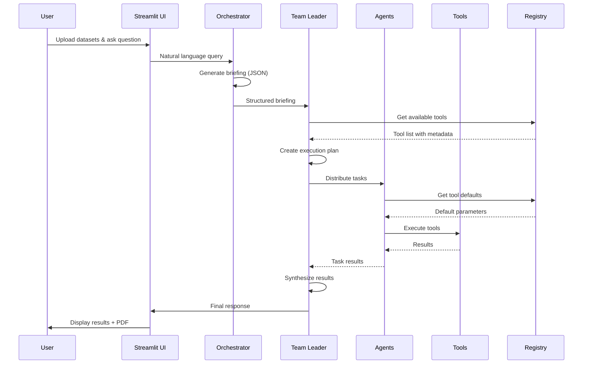

# Modular Architecture Guide

## Overview

The Autonomous Data Consulting system has been fully migrated to a modular architecture with clear separation of concerns and comprehensive test coverage.

## Architecture Layers

### 1. Presentation Layer
- **File**: `app.py`
- **Responsibility**: Streamlit UI, user interaction, orchestration
- **Key Components**: File upload, chat interface, visualization rendering

### 2. Agent Layer
- **File**: `agents.py`
- **Components**: 6 specialized AI agents
  - `OrchestratorAgent`: Query → Structured briefing
  - `TeamLeaderAgent`: Briefing → Execution plan → Synthesis
  - `DataArchitectAgent`: Data preparation and joining
  - `DataAnalystTechnicalAgent`: Statistical analysis
  - `DataAnalystBusinessAgent`: Visualizations and insights
  - `DataScientistAgent`: Machine learning

### 3. Tool Layer
- **Package**: `tools/` (21 modules, 211 functions - 125 exported)
- **Registry**: `tool_registry.py` (86 registered tools)
- **Categories**:
  - Data Profiling & Quality
  - Statistical Analysis
  - Machine Learning
  - Advanced Analytics (forecasting, risk, simulation)
  - Financial Analytics (NPV, IRR, options)
  - Mathematical Operations (calculus, algebra)
  - Geometric Calculations
  - Feature Engineering
  - Business Analytics
  - Time Series Analysis
  - Text & NLP
  - Visualization
  - Data Transformation & Cleaning

### 4. Infrastructure Layer
- **State Management**: `state.py` (AppState with typed fields)
- **Rate Limiting**: `rate_limiter.py` (RPM control)
- **Optimizations**: `optimizations.py` (parallel execution, metrics)
- **UI Components**: `ui_components.py` (reusable UI elements)

### 5. Configuration Layer
- **LLM Config**: `config.py` (multi-provider support)
- **Prompts**: `prompts.py`, `prompt_templates.py` (dynamic templates)
- **Tool Registry**: `tool_registry.py` (metadata, defaults, validation)

## Module Organization

### Tools Package Structure

```
tools/
├── __init__.py                 # Central export hub (125 exported functions)
│
├── Core Analysis
│   ├── data_profiling.py      # 15 functions
│   ├── statistical_tests.py   # 11 functions
│   ├── correlation_analysis.py # 4 functions
│   └── outlier_detection.py   # 3 functions
│
├── Machine Learning
│   ├── machine_learning.py    # 15 functions
│   ├── clustering.py          # 3 functions
│   └── feature_engineering.py # 5 functions
│
├── Advanced Analytics
│   ├── advanced_analytics.py  # 7 functions (forecasting, risk, simulation)
│   ├── financial_analytics.py # 5 functions (NPV, IRR, Black-Scholes)
│   ├── time_series.py         # 4 functions
│   └── business_analytics.py  # 4 functions
│
├── Mathematical Tools
│   ├── math_operations.py     # 7 functions (arithmetic, calculus)
│   ├── advanced_math.py       # 3 functions (linear algebra, optimization)
│   └── geometry.py            # 3 functions (distances, area)
│
├── Data Operations
│   ├── data_transformation.py # 8 functions
│   ├── data_cleaning.py       # 6 functions
│   └── file_operations.py     # 3 functions
│
├── Specialized Analysis
│   ├── text_analysis.py       # 3 functions
│   ├── geospatial.py          # 1 function
│   └── visualization.py       # 7 functions
│
└── Internal
    └── helpers.py              # 7 utility functions
```

## Design Principles

### 1. Modularity
- Each module has a single, well-defined responsibility
- Clear boundaries between modules
- Minimal coupling, high cohesion

### 2. Discoverability
- Tool registry with metadata
- Automatic parameter defaults
- Category-based organization
- Comprehensive documentation

### 3. Extensibility
- Easy to add new tools
- Plugin-like architecture
- Dynamic tool loading
- Backward compatibility

### 4. Testability
- Each module independently testable
- 23 test files with 100% pass rate
- Integration tests for tool mapping
- Defensive testing for optional dependencies

### 5. Performance
- Parallel execution of independent tasks
- Plan caching for repeated queries
- Context compression for large results
- Lazy loading of heavy dependencies

## Data Flow



## State Management

### AppState (Typed State)
```python
@dataclass
class AppState:
    # Discovery state
    discovery_done: bool
    discovery_summary: str
    discovery_insights: List[str]
    
    # Session control
    response_style: str
    conversation_history: List[Dict]
    intent_mode: str
    clarify_pending: bool
    
    # Execution context
    last_briefing: Dict
    last_plan: Dict
    last_synthesis: str
```

### Synchronization
- Bidirectional sync with `st.session_state`
- Typed access via `AppState.get()`
- Automatic migration from legacy keys

## Tool Registry System

### ToolMetadata
```python
class ToolMetadata:
    function: Callable
    get_defaults: Callable[[pd.DataFrame], Dict]
    description: str
    category: str
    requires_numeric: bool
    requires_categorical: bool
    min_rows: int
```

### Features
- **Automatic Defaults**: Generate parameters from DataFrame
- **Validation**: Check if tool can execute on given data
- **Discovery**: Query tools by category
- **Documentation**: Built-in descriptions

## Error Handling

### Retry Strategy
1. Task fails → Capture error
2. Regenerate plan with error context
3. Retry failed task once
4. Cascade: Re-execute dependent tasks

### Validation
- **Pydantic Models**: Validate briefing and plan JSON
- **Auto-correction**: LLM fixes invalid JSON
- **Fallback Plans**: Minimal plan on repeated failures

## Performance Optimizations

### 1. Parallel Execution
- Identify independent tasks
- Execute in parallel using ThreadPoolExecutor
- Respect dependencies

### 2. Context Compression
- Sample large DataFrames
- Truncate long strings
- Summarize results for synthesis

### 3. Caching
- Cache successful plans by intent hash
- Reuse plans for similar queries
- Session-based storage

### 4. Rate Limiting
- RPM tracking per provider
- Visual feedback in UI
- Automatic throttling

## Testing Strategy

### Unit Tests
- Each module tested independently
- Mock external dependencies
- Edge case coverage

### Integration Tests
- `test_tools_mapping.py`: Validates all 86 registered tools
- Tests default parameter generation
- Ensures all tools execute without errors

### Test Coverage
```
23 tests, 100% pass rate
- Clustering: 3 tests
- Feature Engineering: 4 tests
- Business Analytics: 3 tests
- Time Series: 2 tests
- Text Analysis: 2 tests
- Data Transformation: 3 tests
- File Operations: 2 tests
- Tool Mapping: 1 integration test
- Type Validation: 1 test
- Time Features: 1 test
```

## Migration Summary

### From Monolithic to Modular

**Before:**
- Single `tools.py` file (2200 lines, 122 functions initially)
- No organization
- Difficult to maintain
- No test coverage

**After:**
- 21 specialized modules
- Clear categorization
- 211 total functions (125 exported)
- 86 tools registered with metadata
- 23 tests with 100% pass rate
- Comprehensive documentation

### Benefits
1. **Maintainability**: Easy to locate and modify functions
2. **Testability**: Each module independently testable
3. **Discoverability**: Tools organized by category
4. **Extensibility**: Simple to add new tools
5. **Performance**: Lazy loading, parallel execution
6. **Documentation**: Self-documenting with metadata

## Best Practices

### Code Style
- All code comments and docstrings in English
- User-facing messages in Portuguese (Brazilian)
- Type hints for all function signatures
- Comprehensive docstrings with Args/Returns

### Module Design
- Single responsibility per module
- Explicit exports via `__all__`
- Minimal dependencies between modules
- Defensive programming for optional dependencies

### Tool Development
- Return dictionaries for structured results
- Handle errors gracefully
- Provide meaningful error messages
- Include parameter validation

## Future Enhancements

### Planned Features
- [ ] Real-time data streaming support
- [ ] SQL database connectors
- [ ] REST API endpoint
- [ ] Collaborative analysis sessions
- [ ] Data versioning
- [ ] Advanced caching strategies

### Tool Additions
- [ ] Deep learning models (PyTorch/TensorFlow)
- [ ] Advanced NLP (transformers)
- [ ] Graph analytics
- [ ] Anomaly detection algorithms
- [ ] Automated feature selection

## References

- [ARCHITECTURE.md](./ARCHITECTURE.md): Detailed architecture
- [TOOLS_REFERENCE.md](./TOOLS_REFERENCE.md): Complete tool reference
- [TESTING.md](./TESTING.md): Testing guidelines
- [CONTRIBUTING.md](../CONTRIBUTING.md): Contribution guide
