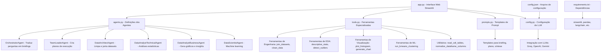

# Diagrama de Estrutura do Projeto

```mermaid
graph TD
    A[app.py - Interface Web Streamlit] --> B[agents.py - Definições dos Agentes]
    A --> C[tools.py - Ferramentas Especializadas]
    A --> D[prompts.py - Templates de Prompt]
    A --> E[config.py - Configuração de LLM]

    B --> F[OrchestratorAgent - Traduz perguntas em briefings]
    B --> G[TeamLeaderAgent - Cria planos de execução]
    B --> H[DataArchitectAgent - Limpa e junta datasets]
    B --> I[DataAnalystTechnicalAgent - Análises estatísticas]
    B --> J[DataAnalystBusinessAgent - Gera gráficos e insights]
    B --> K[DataScientistAgent - Machine learning]

    C --> L[Ferramentas de Engenharia: join_datasets, clean_data]
    C --> M[Ferramentas de EDA: descriptive_stats, detect_outliers]
    C --> N[Ferramentas de Visualização: plot_histogram, generate_chart]
    C --> O[Ferramentas de ML: run_kmeans_clustering]
    C --> P[Utilitários: read_odt_tables, normalize_dataframe_columns]

    D --> Q[Templates para briefing, plano, síntese]

    E --> R[Integração com LLMs: Groq, OpenAI, Gemini]

    S[config.json - Arquivo de configuração] --> E
    T[requirements.txt - Dependências] --> U[streamlit, pandas, langchain, etc.]
```
