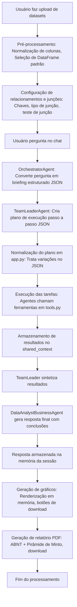

# Diagrama de Processamento de Dados

```mermaid
flowchart TD
    A[Usuário faz upload de datasets] --> B[Pré-processamento: Normalização de colunas, Seleção de DataFrame padrão]
    B --> C[Configuração de relacionamentos e junções: Chaves, tipo de junção, teste de junção]
    C --> D[Usuário pergunta no chat]
    D --> E[OrchestratorAgent: Converte pergunta em briefing estruturado JSON]
    E --> F[TeamLeaderAgent: Cria plano de execução passo a passo JSON]
    F --> G[Normalização do plano em app.py: Trata variações no JSON]
    G --> H[Execução das tarefas: Agentes chamam ferramentas em tools.py]
    H --> I[Armazenamento de resultados no shared_context]
    I --> J[TeamLeader sintetiza resultados]
    J --> K[DataAnalystBusinessAgent gera resposta final com conclusões]
    K --> L[Resposta armazenada na memória da sessão]
    L --> M[Geração de gráficos: Renderização em memória, botões de download]
    M --> N[Geração de relatório PDF: ABNT + Pirâmide de Minto, download]
    N --> O[Fim do processamento]
```
