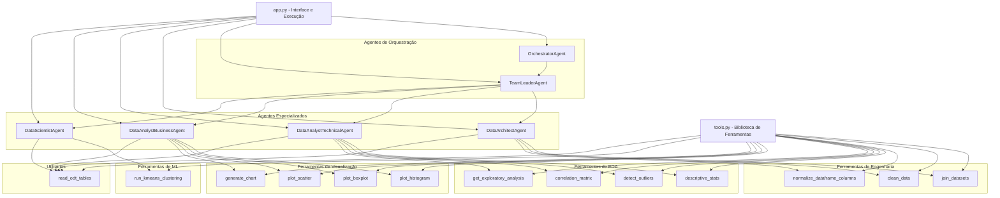

# Diagrama de Relacionamentos entre Agentes e Ferramentas

```mermaid
flowchart TD
    subgraph "Agentes de Orquestração"
        A[OrchestratorAgent]
        B[TeamLeaderAgent]
    end

    subgraph "Agentes Especializados"
        C[DataArchitectAgent]
        D[DataAnalystTechnicalAgent]
        E[DataAnalystBusinessAgent]
        F[DataScientistAgent]
    end

    subgraph "Ferramentas de Engenharia"
        G[join_datasets]
        H[clean_data]
        I[normalize_dataframe_columns]
    end

    subgraph "Ferramentas de EDA"
        J[descriptive_stats]
        K[detect_outliers]
        L[correlation_matrix]
        M[get_exploratory_analysis]
    end

    subgraph "Ferramentas de Visualização"
        N[plot_histogram]
        O[plot_boxplot]
        P[plot_scatter]
        Q[generate_chart]
    end

    subgraph "Ferramentas de ML"
        R[run_kmeans_clustering]
    end

    subgraph "Utilitários"
        S[read_odt_tables]
    end

    A --> B
    B --> C
    B --> D
    B --> E
    B --> F

    C --> G
    C --> H
    C --> I

    D --> J
    D --> K
    D --> L
    D --> M

    E --> N
    E --> O
    E --> P
    E --> Q

    F --> R

    C --> S
    D --> S
    E --> S
    F --> S

    T[app.py - Interface e Execução] --> A
    T --> B
    T --> C
    T --> D
    T --> E
    T --> F

    U[tools.py - Biblioteca de Ferramentas] --> G
    U --> H
    U --> I
    U --> J
    U --> K
    U --> L
    U --> M
    U --> N
    U --> O
    U --> P
    U --> Q
    U --> R
    U --> S
```
