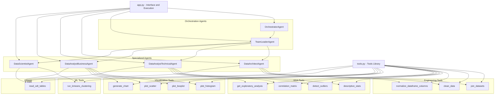

# Relationships Diagram between Agents and Tools

## Update Notes

- QA Review: while not shown as a separate agent in this diagram, the QA step is conducted via `prompts.py` (QA Review Prompt) between the `TeamLeaderAgent` synthesis and the `DataAnalystBusinessAgent` final response.
- Selective retry + cascading re-execution: when a tool fails, the `TeamLeaderAgent` is asked to correct the plan. The task is retried once and, if outputs change, already-completed dependents are reprocessed (logic in `app.py`).
- Success plan cache: error-free plans may be reused according to the Sidebar configuration (implemented in `app.py` using `st.session_state['plan_cache']`).
